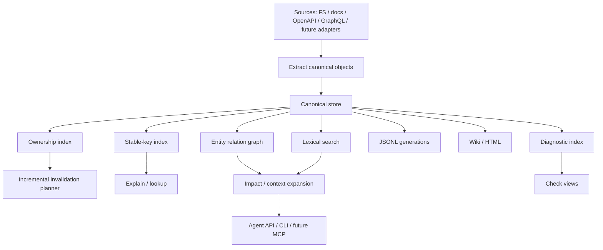

# Indexing Pipeline

Status: implemented, reusable app-layer pipeline with app-layer adapter registry, incremental merge, JSONL read-model writer, Markdown wiki projection, and static HTML reporting from canonical snapshots.

Athanor currently has a minimal but complete knowledge pipeline:

```text
SourceProvider
  -> Extractor
  -> Linker
  -> Checker
  -> JSONL KnowledgeStore
  -> JSONL, Markdown wiki, and HTML report read models
```

The CLI entry point is:

```bash
cargo run -p ath -- index .
cargo run -p ath -- index . --validate-only
cargo run -p ath -- bench --size small
```

## Target Architecture



## Current Flow

1. `athanor-source-fs` discovers project files and returns `SourceFile` values.
2. `athanor-extractor-basic` creates file entities and `file_discovered` facts.
3. `athanor-extractor-markdown` parses optional YAML frontmatter plus CommonMark/GFM heading events, then creates identity/language-aware documentation page/section entities, runbook entities for runbook frontmatter, operation-step entities for runbook ordered-list items, and `doc_section_found` facts.
4. `athanor-extractor-openapi` dispatches project OpenAPI 3.1 to `oas3` and 3.0 to a maintained-YAML legacy parser, ignores OpenAPI files under `tests/fixtures` during project discovery, then extracts operations, component schemas, request/response schema uses, and media examples.
5. `athanor-extractor-graphql` extracts standalone GraphQL SDL, root schema declarations, operation files, fragment files, directive definitions, and introspection JSON into shared API endpoint/schema or adapter-scoped fragment/directive entities with source evidence and ownership, and emits bounded diagnostics for invalid or unsupported explicit GraphQL inputs.
6. `athanor-extractor-operations` parses dotenv, Cargo manifest, Makefile, Dockerfile, shell script, docker-compose, GitHub Actions, Kubernetes YAML, SQL migration, and runtime config sources into environment-variable, package/dependency, script-command, deployment/service, database migration, and runtime configuration knowledge.
7. `athanor-extractor-js-ts` parses JavaScript, JSX, TypeScript, TSX, and `package.json` files through tree-sitter grammars, then emits module, declaration, package, dependency, definition-fact, parser-error, and unsupported-syntax knowledge. Feature-gated `js-ts-precision` builds also parse affected JS/TS files with Oxc, compare bounded normalized findings, and emit disagreement diagnostics without changing the canonical-output backend.
8. `athanor-extractor-rust` parses Rust files into module, function, symbol, and environment-variable entities plus `symbol_defined` and `env_var_used` facts.
9. `athanor-linker-markdown` creates `contains` relations plus verified `documents` relations for exact entity/concept keys declared in Markdown frontmatter.
10. `athanor-linker-api` links OpenAPI operations to matching Rust handlers, Markdown API documentation, same-document request/response component schemas, and declared examples. For GraphQL, it resolves cross-file fragment spreads, inline type conditions, fragment type conditions, and nested fragment spreads into verified relations.
11. When a RusTok repository opts in through `.athanor/adapters/rustok-ffa.json`, `athanor-adapter-rustok-ffa` extracts FFA surface/layer markers from code, links FFA surface/layer/file relations, and emits `rustok_ffa_*` diagnostics.
12. When a RusTok repository opts in through `.athanor/adapters/rustok-fba.json`, `athanor-adapter-rustok-fba` extracts FBA registry, port-code, local-plan, and central-board markers, links FBA module/contract/port/operation/profile/dependency relations, and emits evidence-backed `rustok_fba_*` diagnostics including secondary documentation drift findings.
13. When a RusTok repository opts in through `.athanor/adapters/rustok-page-builder.json`, `athanor-adapter-rustok-page-builder` extracts Page Builder provider registry, adapter seam, wave evidence, consumer manifest, content-format, and FSD surface markers, links Page Builder provider/consumer/contract/capability/fallback/evidence/content/FSD relations, and emits `rustok_page_builder_*` diagnostics.
14. `athanor-checker-markdown` creates documentation structure, unresolved-reference, and duplicate-identity diagnostics.
15. `athanor-checker-api` diagnoses OpenAPI operations without linked implementations or documentation, local component schema references that did not resolve, examples that violate their declared schemas, OpenAPI/GraphQL response field drift, undocumented environment variables, undocumented runtime configuration keys, undocumented script commands, undocumented deployment resources, runbooks not tied to operational knowledge, runbooks without operation steps, and runbook steps that do not cover declared operational targets.
16. `RuntimeBuilder` discovers adapter plugin manifests from `.athanor/adapters/*.json` and `.athanor/plugins/*/athanor-adapter.json`, then applies enabled adapter entries that match known app-layer factory ids.
17. `RuntimeBuilder` builds the configured `IndexPipeline` from an `AdapterRegistry`.
18. `IndexStateStore` classifies discovered files as changed, unchanged, or removed by comparing them with the previous state.
19. File additions or removals trigger a safe full rebuild so absence diagnostics cannot remain stale.
20. `IndexPipeline` extracts changed files only when a previous canonical snapshot is available from `CanonicalSnapshotStore`; extractor/source-file tasks run concurrently with a fixed limit of 16 in-flight tasks.
21. `IndexPipeline` skips canonical snapshot creation when a previous snapshot is available and
    source discovery finds no changed or removed files; otherwise it carries unchanged canonical
    objects forward from the previous canonical snapshot, rewrites carried snapshot ids to the new
    snapshot, drops objects whose ownership includes changed or removed paths, and canonicalizes
    merged objects by id so duplicated carried/new objects cannot persist in the next snapshot.
21. `IndexPipeline` builds an affected subset from newly extracted objects, then passes it to linkers and checkers alongside the merged full context. In-process linker and checker inputs share full-context entity, fact, and relation lists through `Arc<Vec<T>>` values so the complete entity and fact lists are moved into shared allocations once and reused across downstream phases.
22. `IndexPipeline` validates newly emitted canonical objects for required evidence and ownership metadata, including diagnostics emitted by extractors or checkers.
23. If validation fails, `ath index` writes the aggregated adapter validation report to the configured validation report path.
24. In `--validate-only` mode, the CLI writes a structured validation result artifact for successful runs, then stops without persisting a canonical snapshot, read model, or index state.
25. `IndexPipeline` records bounded indexing metrics for phase timings, aggregated adapter timings and object counts, affected-file counts, canonical object counts, and validation issue counts. `ath index --json` and other JSON-facing callers return the report without requiring generated JSONL reads.
26. `ath bench --size <small|medium|large>` creates synthetic Markdown, Rust, and OpenAPI fixtures, runs the normal index path, and emits `athanor.index_benchmark.v1` with the same bounded index metrics so performance regressions can be measured without reading generated JSONL artifacts.
27. Otherwise, `IndexPipeline` stores the merged canonical objects for the current run through `KnowledgeStore`.
28. `JsonlReadModelWriter` exports JSONL read models to `.athanor/generated/current/jsonl`.
29. `IndexStateStore` persists file hash state to `.athanor/state/index-state.json` for the next run.
30. On demand, `ath coverage` reads the latest durable canonical snapshot plus persisted index state and emits bounded `athanor.coverage.v1` file, adapter, and diagnostic-kind coverage rows without running indexing or reading generated JSONL artifacts.
31. On demand, `ath wiki` loads the latest durable canonical snapshot and performs a staged replacement of the neutral Markdown wiki read model.
32. On demand, `ath report html` loads the same snapshot and performs a staged replacement of a self-contained HTML report.
33. On demand, `ath generate` projects JSONL, wiki, and HTML into one immutable generation, writes a complete generation manifest, and then switches `current.json` to that generation.
34. On demand, `ath check env` reports environment variables used by Rust code or declared in operations/config files, plus runtime configuration keys, that are not linked from editable documentation.
35. On demand, `ath check scripts` reports operational script commands not linked from editable documentation.
36. On demand, `ath check deployment` reports deployment and service resources not linked from editable documentation.
37. On demand, `ath check runbooks` reports runbooks that do not reference known operational targets or have no extracted operation steps.
38. On demand, `ath validate-changed` runs a fast extractor-only preflight for explicit `--file` selections, changed Git paths, or index-state changed paths outside Git repositories, without running linkers, checkers, storage, state updates, or read-model writes.
39. On demand, `ath update --changed` runs the same incremental indexing path through an explicit update command, writes a new durable snapshot, refreshes JSONL read models, and updates persisted file change state.
40. On demand, `ath check affected` compares current source discovery with persisted index state and reports latest-snapshot diagnostics plus stale local artifact status for changed workflows without writing a new snapshot.
41. On demand, `ath context --diff` builds a bounded context pack rooted in entities owned by changed or removed files without writing a new snapshot.
41. On demand, `ath repair inspect` validates local canonical and generated pointers, manifests, and orphaned immutable artifacts without modifying files.
42. On demand, `ath repair cleanup` removes orphaned immutable canonical snapshots and generated generations identified by repair inspection.
43. On demand, `ath repair regenerate` publishes a fresh coordinated generated generation when the current generated pointer is stale, missing, or invalid.
44. On demand, `ath repair recover-canonical` repoints a missing or invalid canonical latest pointer to the newest valid local canonical snapshot.
45. On demand, `ath repair apply` runs canonical recovery, generated regeneration, and orphan cleanup in deterministic order.
46. On demand, `ath docs operations check` aggregates environment, script, deployment, and runbook documentation diagnostics and fails when any are open.
47. On demand, `ath docs check` evaluates editable documentation under the configured path against frontmatter completeness and diagnostic severity policy.
48. On demand, `ath docs drift` reports editable documentation not verified against the latest canonical snapshot.
49. On demand, `ath docs propose-fix` writes a reviewable JSON patch proposal for editable documentation frontmatter policy and drift findings.
50. On demand, `ath docs apply-patch <id-or-path>` explicitly applies one generated documentation patch proposal after verifying it still targets the latest canonical snapshot.
51. On demand, `ath api snapshot` publishes the latest API contract immutably, `ath api diff` compares contract snapshots, and `ath api cleanup` removes old API contract artifacts through explicit retention. When `[api.retention].auto_cleanup` or a one-off `--cleanup` flag is enabled, successful snapshot and diff commands run the same retention cleanup after publication.

## Pipeline Assembly

## Snapshot Query Semantics

Low-level `KnowledgeStore` queries always receive a `SnapshotSelector`. `LatestCommitted` resolves
only to a committed snapshot; `Exact` rejects a known but uncommitted snapshot. Relation and
diagnostic filters use canonical `EntityId` values, not stable keys. Application callers resolve a
`StableKey` through the separate `EntityResolver` port before issuing an ID-based query. This keeps
storage foreign keys canonical and gives every backend the same snapshot visibility contract.
The reusable `athanor-store-conformance` crate verifies this contract for the in-memory and JSONL
stores; SurrealDB execution remains an environment-backed integration check.

The JSONL canonical store writes an immutable snapshot to a unique sibling staging directory and
renames it into `snapshots/<snapshot-id>` only after every JSONL file and manifest is complete. It
then publishes the latest pointer through a staged replacement. Coordinating that canonical
publication with the separate index-state and read-model publications remains a planned app-layer
transaction boundary.

JSONL uses a project-local OS writer lock plus a persisted snapshot sequence while allocating and
committing snapshot IDs, so independent local processes cannot reuse a snapshot directory name.
At snapshot allocation it also removes only Athanor-owned stale staging names while holding that
lock; unrelated files are never selected for recovery.

SurrealDB is opt-in: the default `ath` and `athd` builds use JSONL and do not compile the SurrealDB
adapter. Enable it explicitly with `--features store-surreal` when a project config selects a
`surreal-*` storage mode.

`ath config validate --path <root>` parses and prints the effective `athanor.toml`, rejecting
unknown fields. `ath config doctor --path <root>` adds a bounded local compatibility report for the
configured storage mode and external-process adapter safeguards.

Trusting an external adapter records both the canonical manifest path/content hash and the SHA-256
hashes of its enabled executable paths. A changed executable therefore requires an explicit
`ath plugins trust <manifest>` again before the runtime accepts that plugin.

`athanor-app` now exposes:

- `IndexPipeline`: orchestration for source discovery, extraction, linking, checking, and store writes.
- `benchmark_index`: synthetic small, medium, and large benchmark fixtures for the normal index path.
- `AdapterRegistry`: ordered factories for source, extractor, linker, and checker adapters.
- `RuntimeBuilder`: app-layer runtime assembly for a project root, registry, and discovered adapter plugin manifests.
- `athanor-runtime-defaults`: the production composition root installed by `ath` and `athd`.
  `athanor-app` uses a focused test-only composition with real JSONL, Tantivy, projector, and
  fixture-relevant source/extractor/linker/checker adapters so package tests exercise the same
  boundaries without depending on binary startup or adding adapter dependencies to production app
  code.
- `JsonlReadModelWriter`: reusable JSONL export for generated read models.
- `JsonlKnowledgeStore`: durable local canonical snapshot store used by the CLI.
- `overview_project`: bounded repository orientation from the latest canonical snapshot.
- `coverage_project`: bounded file, adapter, and diagnostic-kind coverage reporting from the latest canonical snapshot and persisted index state.
- `capabilities_project`: bounded analysis-completeness reporting (content-unprocessed files, per-language and per-adapter completeness, and below-confidence facts) from the latest canonical snapshot and persisted index state.
- `search_project`: bounded BM25 lexical entity search from the latest canonical snapshot and disposable Tantivy read model.
- `context_project`: task-focused context-pack generation from the latest canonical snapshot.
- `change_map_project`: bounded task-, target-, or diff-rooted change locations with deterministic
  relation-chain explanations, evidence, diagnostics, test coverage, and adapter annotations.
- `explain_project`: exact stable-key entity explanation from the latest canonical snapshot.
- `export_graph`: bounded JSON/GraphML graph export from the latest canonical snapshot.
- `related_graph`: bounded related-entity exploration from one exact stable key.
- `shortest_graph_path`: bounded shortest-path search between two exact stable keys.
- `graph_hubs`: bounded degree-centrality ranking over canonical relations.
- `graph_pagerank`: bounded directed PageRank ranking over canonical relations.
- `graph_cycles`: bounded directed-cycle detection over canonical relations.
- `rustok_ffa_audit`, `graph_ffa_surface`, and `graph_ffa_violations`: bounded RusTok FFA read models from canonical FFA entities, relations, and diagnostics, with observed/actionable/scaffold/host-wiring audit scope and explicit core/transport/UI structural completion reported separately.
- `rustok_fba_audit`, `graph_fba_module`, `graph_fba_port`, `graph_fba_dependencies`, and `graph_fba_violations`: bounded RusTok FBA read models from canonical FBA entities, relations, and diagnostics, with registry-backed/dependency-only and migration-status counts plus applicable evidence-derived contract requirements kept explicit.
- `rustok_page_builder_audit`, `graph_page_builder_provider`, `graph_page_builder_consumer`, and `graph_page_builder_violations`: bounded RusTok Page Builder read models from canonical Page Builder entities, relations, and diagnostics.
- `list_registered_projects`, `register_project`, `resolve_registered_project`, and
  `unregister_project`: explicit user-level repository identity management for future daemon and
  MCP routing.
- `serve_daemon` and `request_daemon`: local daemon lifecycle and newline-delimited JSON command
  protocol for one explicitly resolved project id.
- `check_project`: scoped API, documentation, environment, script, deployment, and runbook diagnostic reporting from the latest canonical snapshot.
- `validate_changed`: extractor-only changed-file preflight from Git status or persisted index state.
- `check_affected`: read-only changed-file diagnostic reporting from latest canonical snapshot plus persisted index state.
- `check_operations_docs`: aggregate environment, script, deployment, and runbook documentation diagnostics from one latest canonical snapshot load.
- `check_docs`: configurable editable-documentation completeness gate from the latest canonical snapshot.
- `docs_drift`: read-only editable-document verification-age report from the latest canonical snapshot.
- `docs_propose_fix`: patch-proposal generation for deterministic editable-document frontmatter remediation.
- `docs_apply_patch`: explicit patch application for generated documentation proposals.
- `snapshot_api_contract`: immutable endpoint/schema/example contract publication from the latest canonical snapshot.
- `diff_api_contracts`: deterministic comparison of two published API contract snapshots.
- `project_wiki`: Markdown wiki projection from the latest canonical snapshot.
- `project_html_report`: static HTML report projection from the latest canonical snapshot.
- `generate_project`: coordinated immutable JSONL/wiki/HTML generation and portable current-pointer publication.
- `inspect_repair`: read-only local artifact pointer and manifest inspection.
- `cleanup_repair`: deterministic orphan canonical snapshot and generated generation cleanup.
- `regenerate_repair`: deterministic stale or missing generated-current repair through coordinated generation.
- `recover_canonical_repair`: deterministic canonical latest-pointer recovery from local valid snapshots.
- `apply_repair`: deterministic orchestration of canonical recovery, generated regeneration, and orphan cleanup.

## Markdown Wiki Projection

`ath wiki [path]` reads the latest durable canonical snapshot without re-indexing and invokes the built-in `MarkdownWikiProjector` through the core `Projector` port. It writes:

- a snapshot summary index
- one page per canonical entity
- one page per open diagnostic
- a versioned manifest with canonical object counts

Entity pages include source locations, matching facts, incoming and outgoing relations, and attached open diagnostics. Pages use neutral-language YAML frontmatter and stable entity or diagnostic ids as file names.

The complete projection is built in a temporary sibling directory, then renamed into place. The previous wiki is retained as a temporary backup until the swap succeeds, so readers never observe partially written pages. On platforms that cannot replace a non-empty directory in one operation, the target can be briefly absent during the swap. The wiki remains fully disposable and can be regenerated from the canonical store.

## HTML Report Projection

`ath report html [path]` reads the latest durable canonical snapshot without re-indexing and invokes `HtmlReportProjector` through the core `Projector` port. It writes a self-contained `index.html`, one `entities/<entity-id>.html` detail page per canonical entity, and a versioned manifest under `.athanor/generated/current/html` by default.

The report shows snapshot metrics, a compact canonical graph summary, a bounded interactive SVG
graph, complete open diagnostics, filterable canonical entity tables, and entity detail pages with
attached facts, relations, diagnostics, ownership, and evidence locations. The interactive graph
deterministically selects up to 80 high-degree entities and 240 canonical relations, reports
omitted counts, and supports node search, relation-kind filtering, zoom, reset, dragging, detail
links, and evidence-backed direct relation inspection. Dynamic canonical values are HTML-escaped,
presentation CSS and scripts are embedded, and the output has no network dependencies. The HTML
and wiki adapters share canonical projection payload and staged directory publication utilities
through `athanor-projector-support`.

## Coordinated Generated Generations

`ath generate [path]` loads the latest durable canonical snapshot once and builds all current read-model formats from that exact object set:

```text
.athanor/generated/generations/<generation>/
  manifest.json
  jsonl/
  wiki/
  html/
```

Generation ids are local zero-padded sequence numbers. The service builds the complete generation in a temporary sibling directory and publishes it with a single directory rename. Published generation directories are immutable and never replaced.

After publication, the service replaces `.athanor/generated/current.json` with an `athanor.generated_current.v1` document containing the generation id, snapshot id, relative generation path, and manifest path. The pointer is the final write, so any projector failure leaves the previous current generation selected. A pointer-write failure can leave a complete unreferenced generation, which is safe and can be collected later.

Generation reports include bounded `athanor.generation_metrics.v1` timings for snapshot loading,
JSONL projection, wiki projection, HTML projection, and final publication. Normal `ath generate`
output prints those timings; existing `repair regenerate --json` includes the complete generation
report when repair-triggered regeneration is needed. Wiki and HTML build one canonical attachment
index per projection and reuse it for every entity page, avoiding repeated full scans of facts,
relations, diagnostics, and entity lookup tables on large repositories.

Coordinated generation projects JSONL first, then builds wiki and HTML outputs in parallel inside
the staged generation directory. The generation is still published only after both projection tasks
finish successfully, so cancellation or projection failure preserves the previously selected
generation pointer.

If `.athanor/generated/current.json` already selects a valid generation for the latest canonical
snapshot, `ath generate` returns an `up_to_date` generation report and skips JSONL, wiki, HTML, and
publication phases. This keeps repeated verification loops from rewriting large generated read
models when no canonical snapshot changed.

Canonical-store and generated-read-model JSONL writers use 1 MiB buffered output with explicit
flushes. This keeps the same JSONL contract while avoiding per-token filesystem writes during large
snapshot storage and generation.

The JSON pointer is used instead of a filesystem symlink so publication works without elevated link privileges on Windows. Individual `ath index`, `ath wiki`, and `ath report html` commands continue to write direct compatibility outputs under `.athanor/generated/current`; only `ath generate` guarantees cross-format snapshot consistency.

## Repair Inspection

`ath repair inspect [path]` is a read-only consistency check for local Athanor artifacts. It inspects
the JSONL canonical store pointer, canonical snapshot manifests, generated generation pointer,
generation manifests, and immutable artifact directories. The command reports:

- the latest canonical snapshot selected by `.athanor/store/canonical/jsonl/latest.json`
- canonical snapshot directories not selected by the latest pointer
- the current generated generation selected by `.athanor/generated/current.json`
- generated generation directories not selected by the current pointer
- invalid JSON, unsupported schemas, missing pointed-to directories, and stale generated outputs built from an older canonical snapshot

`--json` emits `athanor.repair_inspect.v1`. The command does not delete, rewrite, or repoint any
artifact.

`ath repair cleanup [path]` consumes the same inspection logic and removes only unselected immutable
artifact directories:

- canonical snapshot directories not selected by `.athanor/store/canonical/jsonl/latest.json`
- generated generation directories not selected by `.athanor/generated/current.json`

`--dry-run` reports planned removals without deleting files. `--generated-only` narrows cleanup to
orphan generated generation directories and leaves orphan canonical snapshots untouched. `--keep-canonical
<N>` and `--keep-generated <N>` retain the newest N orphan canonical snapshots or generated
generations while still allowing older orphans to be removed. `--json` emits
`athanor.repair_cleanup.v1`, including the initial inspection, removed or planned removals, retained
artifacts, and remaining issues after cleanup. The command does not rewrite pointers, regenerate
stale outputs, or remove the current canonical snapshot or current generated generation.

`ath repair regenerate [path]` repairs generated-current selection issues by running the same
coordinated generation path as `ath generate`. It publishes a new immutable generation from the
latest canonical snapshot and updates `.athanor/generated/current.json` only after JSONL, wiki, and
HTML outputs succeed. It runs only when inspection reports a stale, missing, or invalid generated
current pointer, when the pointer references a missing generation directory, when pointer path
fields do not match the expected generation layout, or when the selected generation manifest is
missing, invalid, or disagrees with the current pointer. `--dry-run` reports whether regeneration is
needed without writing outputs. `--json` emits `athanor.repair_regenerate.v1`, including the initial
inspection, the published generation when one was created, and remaining issues. Old generated
generations become cleanup candidates and are removed only by `ath repair cleanup`.

`ath repair recover-canonical [path]` repairs a missing, invalid, or dangling
`.athanor/store/canonical/jsonl/latest.json` pointer. It scans local canonical snapshot directories,
selects the newest snapshot whose manifest has the supported schema and matching snapshot id, and
atomically rewrites only `latest.json`. `--dry-run` reports the selected snapshot without writing.
`--json` emits `athanor.repair_recover_canonical.v1`, including the initial inspection, selected
snapshot, recovered snapshot when written, and remaining issues. The command does not create,
modify, or delete canonical snapshot directories.

`ath repair apply [path]` runs the deterministic repair stages in order:

1. canonical latest-pointer recovery
2. coordinated generated-current regeneration
3. orphan canonical snapshot and generated generation cleanup

`--dry-run` returns the planned stage reports without writing or deleting artifacts. Without
`--dry-run`, the command may delete orphan canonical snapshots and orphan generated generations
through the same rules as `ath repair cleanup`. `--generated-only`, `--keep-canonical <N>`, and
`--keep-generated <N>` are passed to the cleanup stage. `--json` emits
`athanor.repair_apply.v1`, including each stage report and final remaining issues.

## Context Pack Generation

`ath overview [path]` reads the latest durable canonical snapshot without re-indexing and returns a
bounded repository orientation report. The app-layer report includes canonical object totals, top
entity and relation kinds, top source roots, API/documentation/operations counters, graph hubs by
relation degree, module summaries ranked by direct `defines`/`contains` members, cross-source-root
integration boundaries with canonical relation ids, and compact open diagnostic summaries.
All ranked sections use the command's `--top` bound. `--json` emits the stable
`athanor.overview.v1` payload. The text output is intended as a quick agent/developer starting
point before using `ath context`, `ath explain`, or `ath impact` for narrower questions.

## Agent Bounded Retrieval Contract

Athanor's generated JSONL, Markdown wiki, HTML report, GraphML/JSON graph exports, API contract
artifacts, and future search/vector outputs are backing read models or human inspection outputs.
They are not the conversational context interface for agents.

Agent-facing workflows must use bounded commands or APIs such as `ath overview`, `ath coverage`,
`ath context --diff`, `ath context`, `ath search`, `ath explain`, `ath graph related`, `ath graph path`,
`ath graph hubs`, `ath graph pagerank`, `ath graph cycles`, `ath check affected`, or future
daemon/query endpoints. Those outputs must be
deterministic, size-limited, and traceable back to canonical ids, stable keys, source anchors, and
evidence.

New features that introduce large generated outputs are not complete until they also provide a
bounded retrieval path, or document why an existing bounded query is sufficient. Full generated
artifact reads may be used for debugging, batch processing, or external tooling, but should not be
required for normal agent use. Bounded outputs should report effective limits and omitted or
truncated counts when additional canonical data exists outside the returned slice.

`ath impact <target>` and `ath impact --diff` report impacted entities, files, and diagnostics from
the latest canonical snapshot. Impacted entities include the raw canonical relation flow and a
stable `path_steps` explanation with relation ids, relation kinds, traversal direction, endpoint
entity ids, stable keys, and names. The text output prints the full relation chain for each impacted
entity so agents can explain why the entity is included instead of only reporting reachability.

`ath change-map <task>`, `ath change-map --target <stable-key-or-path>`, and `ath change-map --diff`
combine bounded lexical roots, explicit canonical roots, or changed-file ownership with deterministic
canonical relation traversal. The `athanor.change_map.v1` report ranks likely edit and inspection
locations, groups them by source file, exposes the complete selected relation chain with relation ids,
kinds, direction, confidence, and evidence, includes open diagnostics and linked-test status, and
reports entity/file/diagnostic omissions. Adapter payload schemas also become generic annotations;
therefore enabled RusTok adapters add RusTok context without making the app service depend on RusTok
crates. The completeness field explicitly warns that missing adapter relations are not proof that no
dependency exists and points callers to bounded coverage output.

`ath context <task>` reads the latest durable canonical snapshot without running indexing again. `ath context --diff` also reads the latest snapshot, compares current source discovery with `.athanor/state/index-state.json`, and uses entities from changed or removed files as direct context roots without committing a new snapshot. The initial context generator:

- tokenizes the task deterministically
- ranks canonical entities by matches in names, titles, stable keys, aliases, and source paths
- applies `summary`, `normal`, `deep`, or `full` presets for context size and relation depth
- accepts explicit token, file, entity, diagnostic, and relation-depth overrides
- expands direct matches by the configured number of relation hops
- includes diagnostics attached to selected entities
- returns stable file and entity scopes
- materializes selected entities, internal relations, and diagnostics in the JSON payload
- records diff changed/unchanged/removed file counts when invoked with `--diff`
- reports effective limits, approximate serialized token usage, omitted object counts, and whether relevance or limits caused omission in the JSON payload

The token budget is a deterministic estimate based on serialized canonical payload bytes divided by four; it is a size guard, not tokenizer-specific accounting. This remains an app-layer lexical slice rather than a `SearchIndex` implementation.

`ath search <query>` is the bounded lexical lookup layer over the disposable Tantivy read model at
`.athanor/generated/current/search`. The app service rebuilds that index when its `index_meta.json`
snapshot id does not match the latest canonical snapshot. JSON output emits `athanor.search.v1`
with the original query, requested limit, returned count, truncation status, omitted lower bound,
canonical entity ids, stable keys, source anchors, and ownership metadata. The command fetches one
extra result internally so agents can tell when the configured limit hides additional matches
without reading generated JSONL or search-index internals. Full snapshot rebuilds add all entity
documents in one batch and commit before opening the search reader, avoiding per-document segment
reloads and obsolete memory-mapped file locks on Windows. Incremental writer instances disable
background segment merging because open readers can retain mapped segment files; later full
snapshot rebuilds compact the disposable index. Tantivy remains a replaceable read-model adapter;
vectors and semantic ranking remain future adapters or services.

`ath graph export --format json` and `ath graph export --format graphml` read the latest durable canonical snapshot without re-indexing and
emit a bounded disposable graph read model. The JSON payload uses schema
`athanor.graph_export.v1`, ranks nodes by relation degree and stable key for deterministic output,
keeps edge evidence source anchors, and reports omitted node/edge counts when `--max-entities` or
`--max-relations` limits truncate the export. The GraphML output serializes the same bounded nodes
and edges with canonical ids, stable keys, kinds, names, source anchors, degrees, statuses,
confidence values, and evidence anchors for graph tooling. The export is derived from canonical
entities and relations only; it does not replace canonical storage and does not write generated
artifacts.

`ath graph related <stable-key>` performs a deterministic breadth-first traversal over incoming and
outgoing canonical relations. `--depth`, `--max-entities`, and `--max-relations` bound the result.
Text output provides compact agent-oriented navigation; `--json` emits
`athanor.graph_related.v1`, including canonical entity ids, stable keys, relation ids, relation
status and confidence, evidence anchors, per-node distance, and a truncation flag. The command
requires an exact stable key, reads only the latest canonical snapshot, and does not write
artifacts.

`ath graph path <from-stable-key> <to-stable-key>` finds one deterministic shortest path while
treating canonical relations as traversable in either direction. The returned relation objects
retain their canonical direction, ids, status, confidence, and evidence anchors. `--max-depth` and
`--max-visited` bound search work; reports distinguish a complete no-path result from a truncated
search. `--json` emits `athanor.graph_path.v1` with the endpoint entities, ordered path nodes and
edges, hop count, visited entity count, and truncation state. Missing endpoint stable keys are
lookup errors. The command reads the latest canonical snapshot without writing artifacts.

`ath graph hubs` ranks connected canonical entities by degree centrality. The report separates
incoming and outgoing degree, retains bounded sorted incoming and outgoing canonical relation ids,
and sorts ties by incoming degree, outgoing degree, and stable key. `--kind` filters by the
serialized canonical entity kind, `--limit` bounds ranked entities, and `--max-relation-ids` bounds
trace ids per direction. `--json` emits `athanor.graph_hubs.v1`. The command excludes disconnected
entities and reads the latest canonical snapshot without writing artifacts.

`ath graph pagerank` ranks canonical entities by directed PageRank over the complete latest
canonical graph. Canonical relations are directed edges; multiple canonical relations between the
same entities remain separate contributions. Dangling score is redistributed across all canonical
entities. `--max-iterations`, `--tolerance`, and `--damping` bound and configure computation;
`--limit` bounds output, and `--max-relation-ids` bounds sorted incoming canonical relation trace
ids per result. `--kind` filters ranked output after the full-graph score calculation, so filtering
does not change centrality. Ties are ordered by stable key. `--json` emits
`athanor.graph_pagerank.v1` with convergence state, effective iteration count, graph counts,
canonical entity identity/source data, scores, omitted counts, incoming relation ids/kinds/source
entity ids, and relation evidence anchors. The command is read-only and does not create a graph
source of truth.

`ath graph cycles` finds simple directed cycles while preserving canonical relation direction.
Search roots and outgoing relations are ordered deterministically, and cycles discovered from
different starting entities are deduplicated by canonical rotation of their relation ids.
`--max-depth` bounds cycle length, `--max-starts` bounds search roots, and `--limit` bounds unique
results. `--json` emits `athanor.graph_cycles.v1` with ordered canonical nodes and evidence-bearing
edges plus explicit truncation and omitted-start counts. The command reads the latest canonical
snapshot without writing artifacts.

## Explicit Project Registry

`ath projects` manages a user-level registry for explicit repository identity:

```bash
ath projects list
ath projects add <project-id> <repository-root>
ath projects resolve <project-id>
ath projects remove <project-id>
```

The default registry is `~/.athanor/projects.json`; `ATHANOR_PROJECT_REGISTRY` or per-command
`--registry` selects another file. The JSON schemas are `athanor.project_registry.v1` for list and
mutation reports and `athanor.project_resolution.v1` for exact resolution.

Project ids are stable lowercase identifiers. Roots are canonical absolute paths. The registry
rejects duplicate ids and duplicate canonical roots, has no implicit default project, and requires
exact ids for resolution. Writes use staged replacement so readers do not observe partially written
JSON.

This registry is routing metadata, not canonical knowledge or a multi-project store. Every
repository keeps its own `.athanor` canonical snapshots, state, generated outputs, API artifacts,
and configuration. Current CLI knowledge commands remain explicitly path-scoped. Future daemon and
MCP multi-repository requests must resolve a project id first and include that identity in protocol
responses and generated routing metadata; they must never answer from an arbitrary registered
repository.

## Local Daemon Protocol

`athd` is the first local daemon entrypoint. It resolves one explicit project id through the
project registry before serving or sending requests:

```bash
athd start <project-id>
athd start <project-id> --transport local-socket --watch
athd serve <project-id> --max-concurrent-requests 4 --max-job-history 1000
athd serve <project-id> --max-request-bytes 1048576 --max-response-bytes 2097152
athd serve <project-id> --transport local-socket
athd serve <project-id> --watch --debounce-ms 1000
athd serve <project-id> --watch --watch-poll --debounce-ms 5000
athd status <project-id>
athd ping <project-id>
athd jobs <project-id> --limit 20
athd job <project-id> job_00000001
athd cancel <project-id> job_00000001
athd index <project-id>
athd generate <project-id>
athd wiki <project-id>
athd report-html <project-id>
athd overview <project-id> --top 10
athd explain <project-id> "api://POST:/login"
athd search <project-id> "login" --limit 10
athd context <project-id> "task" --level summary --budget 2000
athd context <project-id> --diff --level summary --budget 2000
athd change-map <project-id> "task"
athd change-map <project-id> --target "api://POST:/login"
athd change-map <project-id> --diff
athd stop <project-id>
```

`athd start` launches the same `serve` command as a background process, redirects daemon logs to
the protected per-user runtime directory, and returns only after a bounded authenticated status
round trip confirms readiness.
Repeated start requests are idempotent when the registered project daemon is already healthy.
`athd serve` remains the foreground/debug form. `athd ping` performs the explicit protocol health
round trip and returns the normal structured status response.

The daemon writes runtime metadata outside the repository:

```text
Linux: $XDG_RUNTIME_DIR/athanor/<project-id>/
Windows: %LOCALAPPDATA%\Athanor\runtime\<project-id>\

  endpoint.json
  token
  lock
  daemon.log
```

`endpoint.json` uses schema `athanor.daemon_endpoint.v2` and records the protocol and Athanor
versions, runtime id, token path, project id, canonical root, registry path, transport, TCP address
or local socket metadata, process id, start time, concurrent request limit, job-history retention
limit, protocol byte limits, and watcher settings. It never contains the token value. The lock uses
an OS advisory file lock, so crashes release ownership automatically even if diagnostic lock metadata
remains. Endpoint and token files are removed when the daemon exits.

Linux runtime directories use mode `0700` and secret files use `0600`. Windows runtime ACL
inheritance is removed and access is granted to the current user. Bound Unix domain sockets are
also forced to mode `0600`; Windows local transport recreates its named-pipe server after every
accepted connection so a disconnected client cannot consume the only listener instance.

Every daemon start generates a fresh 256-bit token. Clients load and attach it automatically.
Authentication is checked before command dispatch or job registration. Protocol v1 is disabled by
default; `--insecure-allow-v1` enables temporary migration compatibility over loopback TCP only.

The default protocol is loopback TCP with one JSON request per connection, terminated by a newline.
`--transport local-socket` switches the same newline-delimited JSON protocol to a Unix domain socket
on Unix or a named pipe on Windows. Non-loopback TCP binds are rejected. Requests use schema
`athanor.daemon_request.v2`; responses use `athanor.daemon_response.v2`.
Request and response messages default to a 1 MiB limit and can be raised or lowered at serve time
with `--max-request-bytes` and `--max-response-bytes`. Oversized requests are rejected, oversized
computed responses are replaced with a structured daemon error response, and clients reject oversized
wire responses instead of parsing truncated JSON. The daemon handles requests concurrently up to
`--max-concurrent-requests`; additional connections receive a structured busy error response after
their bounded request line is read. Every request carries a `project_id`, and the server rejects
requests that do not match the endpoint's project identity. The implemented commands are:

- `status`: returns protocol and Athanor versions, lifecycle state, uptime, active jobs, cache state,
  last successful index snapshot, and endpoint metadata.
- `jobs`: returns a bounded `athanor.daemon_jobs.v1` report from the in-memory daemon job registry.
- `job`: returns one exact daemon job by id.
- `cancel`: cancels queued daemon jobs immediately and requests cooperative cancellation for running
  index, generation, wiki, and HTML report jobs.
- `index`: starts one background indexing job for the project and immediately returns its job record.
- `generate`: starts one background coordinated read-model generation job and immediately returns
  its job record.
- `wiki`: starts one background Markdown wiki projection job and immediately returns its job record.
- `report-html`: starts one background HTML report projection job and immediately returns its job
  record.
- `overview`: runs the same bounded `overview_project` query against the latest canonical snapshot.
- `explain`: resolves one exact canonical stable key against the latest canonical snapshot.
- `search`: runs the same bounded lexical entity search against the latest canonical snapshot and
  disposable local search read model.
- `context`: runs the same bounded `context_project` query against the latest canonical snapshot.
  With `--diff`, it roots context in changed or removed files from persisted index state without
  committing a new index snapshot.
- `change-map`: runs the same bounded `change_map_project` query from a task, exact stable key/source
  path, or changed-file diff and returns relation-chain explanations, evidence, diagnostics, test
  coverage, adapter annotations, and omitted counts.
- `shutdown`: rejects new work, requests cooperative cancellation, drains active jobs for the
  configured timeout, and removes endpoint/token metadata.

Daemon status, overview, explain, search, context, and change-map requests are read-only. Daemon context requests
expose the normal level and explicit limit overrides, including diff-based changed-file context; they
do not mutate snapshots or index state. The job registry records daemon lifecycle jobs, completed or
failed read-only `overview`/`explain`/`search`/`context`/`change-map` request jobs, background indexing jobs, and
background generation jobs. Finished jobs can include a
structured `result`; index jobs record the published snapshot id, file counts, and JSONL output
directory, while generate jobs record the published generation id, selected snapshot id, current
pointer, and canonical object counts. Direct wiki and HTML report jobs record the selected snapshot
id, output directory, and canonical object counts. `athd index` reuses the existing `index_project`
path and rejects a second concurrent indexing job for the same daemon so snapshot writers do not
overlap. Daemon overview, explain, search, and non-diff context requests cache the latest canonical
snapshot in memory after the first load. The daemon also retains one snapshot-keyed Tantivy search
handle and bounded 64-entry least-recently-used caches for completed overview and non-diff context
results. Search and context share the same in-memory search handle instead of reopening the on-disk
index for each request. Successful daemon-owned index jobs invalidate the complete cache epoch before
subsequent read-only requests. Diff context still performs current source discovery and index-state
comparison before building its bounded pack. `athd generate`, `athd wiki`, and `athd report-html` reuse the existing projection paths
and reject a second concurrent job of the same kind so output publishers do not overlap. Job history
is retained in memory up to `--max-job-history`; pruning removes the oldest finished records first
and never removes queued, running, or cancelling records. Cancellation is cooperative: background
index and projection jobs are registered with a shared cancellation token before worker start.
Queued jobs become cancelled immediately. Running jobs move to `cancelling` and stop at safe stage
boundaries. Indexing checks cancellation before canonical object writes and snapshot commit.
Coordinated generation checks between projections and before publishing its immutable generation;
wiki and HTML projectors also check while rendering staged entity and diagnostic files, before their
atomic directory replacement.
If cancellation arrives after an atomic commit or publication has started, that operation is allowed
to complete and the job succeeds rather than reporting a cancelled job with published output.
Cancellation fault tests exercise real background indexing and coordinated generation after those
jobs enter active execution. They assert that cancellation before commit/publication leaves the
canonical latest pointer, index state, read model, and generated-current pointer unchanged. A
concurrent 48-request read-only burst verifies that cached bounded queries remain available during
an index job.
Read-only jobs without a cancellation token still return an explicit non-cancellable error if a
concurrent request attempts to cancel them. With `--watch`, the daemon watches the project root
recursively through `notify-debouncer-mini`, ignores `.athanor` artifact changes, and schedules a
debounced background index job when source paths change. By default it uses the
platform-recommended watcher backend; `--watch-poll` selects the polling backend for filesystems
where native notifications are unavailable or unreliable. The watcher is a scheduler; persisted
content hashes still decide which files actually changed.
Logs continue to use stderr or tracing sinks and are kept separate from structured protocol
responses.

## Entity Explanation

`ath explain <stable-key>` reads one exact canonical entity from the latest durable snapshot without
re-indexing. The app-layer explanation includes:

- the full canonical entity and its source metadata
- facts where the entity is either subject or object
- outgoing and incoming relations, each resolved to the neighboring entity when available
- diagnostics attached to the entity
- the snapshot id and `athanor.entity_explanation.v1` response schema

The default CLI output is a compact directional summary. `--json` returns the complete explanation,
including canonical evidence, confidence, status, ownership, and payload fields. Stable-key lookup is
exact and currently explains one canonical entity at a time.

## Diagnostic Check Views

`ath check api`, `ath check docs`, `ath check env`, `ath check scripts`, `ath check deployment`, and `ath check runbooks` read open diagnostics from the latest durable
canonical snapshot without re-indexing. The app layer classifies diagnostic kinds into API,
documentation, environment, script, deployment, and runbook scopes, sorts results by severity and diagnostic id, and returns:

- snapshot id and requested scope
- total, critical, high, medium, and low counts
- complete canonical diagnostic objects

The default CLI output is a compact source-oriented list. `--json` emits the
`athanor.diagnostic_check.v1` report. `ath check env` selects `missing_env_var` diagnostics produced
from canonical `EnvVar` entities and `documents` relations, plus scoped `missing_documentation`
diagnostics for runtime configuration keys. `ath check scripts` selects
`missing_documentation` diagnostics whose payload scope is `scripts`, produced from canonical
`ScriptCommand` entities and `documents` relations. `ath check deployment` selects
`missing_documentation` diagnostics whose payload scope is `deployment`, produced from canonical
`DockerService` entities and `documents` relations. `ath check runbooks` selects scoped
`stale_documentation` diagnostics produced from canonical `Runbook` entities whose declared
operation targets do not resolve to known operational entities, whose body has no extracted
ordered-list operation steps, or whose extracted steps do not mention any declared operational
target. These commands are currently read-only views and
return success after a valid query even when diagnostics exist; CI failure thresholds and
strict-mode policy remain deferred outside API strict mode.

`ath update --changed` is the writable changed-file workflow. It calls the same app-layer indexing
service as `ath index`, uses the persisted index state to classify changed, unchanged, and removed
files, writes a fresh canonical snapshot, refreshes `.athanor/generated/current/jsonl`, and updates
`.athanor/state/index-state.json` after success. The command requires `--changed` so accidental
full-style update entrypoints stay explicit; `--json` emits the serialized index report.

`ath validate-changed` is the fast extractor-only preflight for tight edit loops. It accepts explicit
`--file <path>` selections for the exact files under repair; without explicit files, it selects
changed, deleted, and untracked paths from `git status --porcelain=v1 -z` when the project is inside
a Git repository, otherwise it compares files from `.athanor/state/index-state.json` against current
file hashes. The command reads only selected changed files, runs matching extractors, validates
emitted canonical metadata, and returns diagnostics plus extraction metrics. It intentionally does
not run linkers, checkers, canonical storage, state updates, or JSONL read-model writes, so it is
useful for parser and extractor diagnostics but does not prove full graph consistency.

`ath check affected` is a read-only changed-file diagnostic and artifact-status view. It loads the
latest canonical snapshot, reads `.athanor/state/index-state.json`, discovers current source files,
and compares the current file hashes with the last committed index state. Open diagnostics are
selected when they touch changed or removed files through attached entity ids, ownership metadata,
or evidence source files. Editable documentation drift is reported only for affected documents
whose `last_verified_snapshot` differs from the latest canonical snapshot. The same report also
inspects local generated artifacts without modifying them: `.athanor/generated/current.json`,
immutable generated generations, direct wiki and HTML report manifests under
`.athanor/generated/current`, `.athanor/api/latest.json`, and existing API diff directories.
`--json` emits `athanor.affected_check.v1` with affected file counts, matching diagnostics,
affected `documentation_drift`, and `stale_artifacts` entries with suggested explicit commands.
The command does not run extraction, linking, checking, regeneration, repair apply, cleanup,
documentation patching, or write a new snapshot.

## Editable Documentation Completeness Gate

`ath docs check` is a read-only CI gate over the latest durable snapshot. It reads `[docs]` and
`[docs.completeness]` from `athanor.toml`, selects only `documentation_layer = "editable"` pages
under `docs.editable_path`, and fails when required frontmatter fields are absent, status is not
allowed, current-snapshot verification is required but stale, or matching open documentation
diagnostics meet the configured severity threshold. `--json` emits the stable
`athanor.docs_check.v1` report before returning a non-zero exit status on failure.

The gate does not re-index or modify documentation. Generated documentation is excluded even when
it is present in a canonical snapshot.

`ath docs drift` uses the same editable path selection but does not apply status, required-field,
or diagnostic thresholds. It reports pages with a missing `last_verified_snapshot` or one older
than the latest canonical snapshot's immediate predecessor;
`--json` emits `athanor.docs_drift.v1`. Drift is informational and does not produce a failing exit
status.

`ath docs operations check` reads the latest durable snapshot once and aggregates the same
environment, script, deployment, and runbook diagnostics exposed by the scoped `ath check`
commands. Text output prints the operational total and then each scoped diagnostic report. `--json`
emits `athanor.operations_docs_check.v1` with total counts plus the four per-scope reports. The
command is read-only and returns a non-zero process status when any operational documentation
diagnostic remains open.

`ath docs propose-fix` reads the same latest snapshot and writes an `athanor.docs_patch.v1` JSON
proposal under `.athanor/patches/docs/` by default. The current proposal generator is intentionally
deterministic. It covers Markdown frontmatter remediation for policy and drift findings, and creates
reviewable Markdown API page drafts for `api_endpoint_implemented_but_not_documented` diagnostics.
Generated API pages include frontmatter `entities` declarations that point at the missing endpoint,
so a later index can convert the reviewed page into a canonical `documents` relation. API drafts use
the canonical API graph when available: linked Rust handlers, request and response schema
relations, examples, response codes, tags, security payloads, and diagnostic evidence are included
without re-parsing source files. Existing editable API documentation pages that already declare or
link to endpoints receive proposed endpoint-specific Athanor-managed contract block updates;
human-authored content outside those blocks is preserved, and the source file is changed only after
explicit `docs apply-patch`. When an editable API page is linked to an endpoint only through
canonical documentation relations, the same proposal can add the endpoint stable key to frontmatter
`entities` so future indexes retain an exact declared reference. When one endpoint is documented by
multiple editable API pages, the proposal also refreshes a generated coordination block that lists
the related pages for review before application. The same pass strips existing Athanor-managed
blocks, scans the remaining human-authored API page text for `METHOD /path` route mentions, and
adds a narrative review block when those mentions no longer match the current endpoints linked to
the page. When the page has exactly one linked current endpoint, the same block includes a
reviewable narrative rewrite draft that shows the original line and a deterministic route
replacement without directly rewriting the human-authored paragraph.
It also creates reviewable operations documentation drafts for `missing_env_var`, scoped runtime
configuration `missing_documentation`, scoped script `missing_documentation`, scoped deployment
`missing_documentation`, and scoped runbook `stale_documentation` diagnostics under the editable
documentation operations path, using frontmatter `entities` declarations that point at the missing
or stale operational stable key.

`ath docs apply-patch <patch-id-or-path>` applies one proposal explicitly. Apply verifies that the
proposal snapshot equals the current canonical snapshot before rewriting or creating editable
Markdown files. Create operations refuse to overwrite existing paths. This preserves the rule that
generated documentation tooling may propose changes, but editable docs are not silently overwritten.

## API Contract Snapshots

`ath api snapshot` selects canonical `ApiEndpoint`, `ApiSchema`, and `ApiExample` entities from the
latest durable snapshot, sorts them by stable key, and writes an immutable
`.athanor/api/snapshots/<snapshot>.json` contract. Repeating the command for the same canonical
snapshot reuses the file only when its content is identical. The portable `.athanor/api/latest.json`
pointer is replaced atomically after publication.

`ath api diff --from <snapshot> --to <snapshot>` compares two published contracts. When ids are
omitted, it compares the latest two snapshots. Breaking endpoint rules cover removed endpoints or
status codes and changed method, path, security, request-schema, or response-schema declarations.
Breaking schema rules cover schema/property type changes, removed properties, and required-set
changes. Description-only changes, optional property additions, additions, and example changes are
informational. Every breaking change carries machine-readable reasons.

`ath api breaking-changes` evaluates the same diff and returns a non-zero exit status when any
breaking change exists, making it suitable for CI once a baseline snapshot is available. The gate
does not mutate canonical storage. Every comparison persists a versioned diff artifact under
`.athanor/api/diffs/<from>--<to>.json`. Breaking entries include evidence-backed, ownership-aware
`api_breaking_change_detected` domain diagnostics. Contract snapshot v2 retains entity identity,
source, and ownership; comparisons with older v1 snapshots fall back to the immutable snapshot
artifact itself as evidence.

`ath check api --strict` combines open diagnostics from the latest canonical snapshot with the
latest API contract comparison. It returns a non-zero exit status when either side has findings.
Without `--strict`, `ath check api` remains the existing read-only diagnostic view.

`ath api cleanup` applies explicit retention to `.athanor/api/snapshots` and `.athanor/api/diffs`.
It does not run during `ath index`, because API contract history is part of the release/comparison
workflow rather than a disposable index byproduct. The command supports `--dry-run`,
`--keep-snapshots`, and `--keep-diffs`; the latest API contract snapshot selected by
`.athanor/api/latest.json` is always retained even when the snapshot retention count is lower.

Automatic API retention is configured under `[api.retention]`:

```toml
[api.retention]
auto_cleanup = false
keep_snapshots = 2
keep_diffs = 2
```

The default is non-destructive. When `auto_cleanup` is true, successful `ath api snapshot` and
`ath api diff` runs call the same cleanup path as `ath api cleanup` with the configured retention
counts. The one-off CLI flags `--cleanup`, `--no-cleanup`, `--keep-snapshots`, and `--keep-diffs`
override the configured policy for `snapshot` or `diff` without changing `athanor.toml`.

The default built-in registry currently assembles:

```text
store:
  JsonlKnowledgeStore

sources:
  LocalFileSystemSource

extractors:
  FileExtractor
  MarkdownExtractor
  OpenApiExtractor
  OperationsExtractor
  JsTsExtractor
  RustExtractor

linkers:
  MarkdownContainmentLinker
  ApiKnowledgeLinker
  JsTsImportLinker
  RustLinker

checkers:
  MarkdownStructureChecker
  ApiConsistencyChecker
  EnvDocsChecker
  ScriptDocsChecker
  DeploymentDocsChecker
  RunbookConsistencyChecker
```

`ath index` is responsible for CLI-facing concerns:

- canonicalizing the project root
- creating the default runtime builder
- choosing the generated JSONL output path
- loading and saving persisted index state
- reporting changed, unchanged, and removed file counts
- calling the read-model writer
- loading the previous canonical snapshot from the durable store
- writing adapter validation reports to `.athanor/generated/current/validation-report.json` or the `--validation-report` path when validation fails
- writing successful validation-only result JSON to `.athanor/generated/current/validation-result.json` or the `--validation-result` path
- supporting `--validate-only` for adapter contract validation without writing snapshots, state, or read models
- supporting `--json` for a bounded machine-readable index report with metrics
- initializing standard tracing output; detailed indexing logs can be enabled with `RUST_LOG=athanor_app=info` and adapter-level diagnostics with `RUST_LOG=athanor_app=debug`
- writing tracing output to `stderr` so normal text output and JSON payloads remain isolated on `stdout`

`RuntimeBuilder` and `AdapterRegistry` are responsible for adapter assembly:

- keeping the built-in adapter list out of CLI code
- discovering adapter plugin manifests from `.athanor/adapters/*.json` and `.athanor/plugins/*/athanor-adapter.json`
- applying enabled manifest entries that map to known app-layer adapter factory ids
- loading external process sources, extractors, linkers, and checkers from manifest `command` entries
- preserving adapter order
- allowing tests, daemon code, and future plugins to share the same assembly point
- logging external process adapter stdout and stderr through tracing

`IndexPipeline` is responsible for orchestration:

- discovering sources
- classifying affected files from persisted state
- emitting structured tracing fields and bounded report metrics for source discovery counts, affected-file classification, full-rebuild reasons, adapter inputs and outputs, validation boundaries, canonical object counts, and snapshot commits
- running extractors for changed files when a previous canonical snapshot is available, with up to 16 concurrent extraction tasks
- falling back to full extraction when the previous canonical snapshot is missing
- merging unchanged canonical objects from the previous canonical snapshot
- pruning carried canonical objects by explicit ownership metadata, with source/evidence fallback for older snapshots
- canonicalizing merged entities, facts, relations, and diagnostics by canonical id before storage, with current-run objects replacing carried objects on id conflicts
- deriving the affected subset from newly extracted objects for downstream adapters
- running linkers over the affected subset with shared full merged context available
- running checkers over the affected subset with shared full merged context available
- validating newly emitted entities/facts/relations/diagnostics before storage
- aggregating adapter validation failures by adapter, object type, object id, and missing metadata field
- stopping before durable writes when the CLI requested validation-only mode
- storing entities/facts/relations/diagnostics
- committing the snapshot

`JsonlReadModelWriter` is responsible for generated read models:

- writing `entities.jsonl`, `facts.jsonl`, `relations.jsonl`, and `diagnostics.jsonl`
- writing `manifest.json`
- keeping JSONL and manifest behavior reusable outside CLI indexing

## Generated Files

```text
.athanor/generated/current/jsonl/
  entities.jsonl
  facts.jsonl
  relations.jsonl
  diagnostics.jsonl
  manifest.json

.athanor/generated/current/wiki/
  index.md
  manifest.json
  entities/<entity-id>.md
  diagnostics/<diagnostic-id>.md

.athanor/generated/current/html/
  index.html
  entities/<entity-id>.html
  manifest.json

.athanor/generated/current.json

.athanor/generated/generations/<generation>/
  manifest.json
  jsonl/
  wiki/
  html/

.athanor/generated/current/
  validation-report.json
  validation-result.json

.athanor/adapters/
  <adapter-plugin>.json

.athanor/plugins/
  <plugin-name>/athanor-adapter.json

.athanor/state/
  index-state.json

.athanor/store/canonical/jsonl/
  latest.json
  snapshots/<snapshot-id>/

.athanor/api/
  latest.json
  snapshots/<snapshot-id>.json
  diffs/<from>--<to>.json

.athanor/patches/docs/
  <docs-patch-id>.json
```

Generated JSONL files and Markdown wiki pages under `.athanor/generated/current` are read models. They are not the source of truth and may be deleted and rebuilt. `validation-report.json` is written only for adapter contract validation failures and is removed after a successful index run. `validation-result.json` is written only for successful `--validate-only` runs and is removed after validation failures or normal index runs. Durable canonical snapshots live under `.athanor/store/canonical/jsonl`. API contract snapshots and diffs under `.athanor/api` are generated artifacts, but they are retained explicitly because they form the contract comparison baseline. The state file records the last indexed file paths, content hashes, language hints, and snapshot id so later runs can classify changed, unchanged, and removed files. Its schema is versioned so changes to built-in extraction, linking, or checking semantics can force a safe one-time full rebuild; FBA source-ownership, dependency graph traversal, per-entity registry source anchoring, and provider-side consumer slug preservation improvements advance it to `athanor.index_state.v43`.

## Current Limitations

- Process source adapters perform a full discovery request per indexing run; streaming discovery and source-level change feeds are not implemented.
- Context generation uses deterministic lexical matching and approximate token accounting; model-specific tokenizers and semantic search are not implemented.
- Entity explanation requires an exact stable key and does not yet provide fuzzy lookup, history, or cross-snapshot comparison.
- Diagnostic check views expose open findings; API strict mode adds a CI threshold and historical contract comparison, while per-kind suppression remains deferred.
- The completeness gate has a project-level severity threshold but does not yet support per-kind suppressions or baseline comparison.
- Rust extraction does not expand macros, emit trait method declarations, or infer imports, calls, and framework routes.
- JavaScript/TypeScript linking materializes exact relative module imports but does not yet resolve package, workspace alias, TypeScript path alias, dynamic, CommonJS, export, or re-export relations, or infer framework-specific routes, components, pages, controllers, or project conventions.
- JavaScript/TypeScript precision verification is opt-in because it parses affected files twice. It
  compares named declarations, static imports, source-backed re-exports, ranges, and recovery state;
  method and variable-bound function comparison remains deferred until both backends expose a
  stable equivalent representation.
- OpenAPI extraction supports 3.0.x and 3.1.x through replaceable parser backends but does not support Swagger 2.x/OpenAPI 3.2, resolve external references, merge specifications, or infer code handlers. Example validation is offline and covers media-type inline/named values; external and schema-level examples remain deferred.
- GraphQL extraction currently covers standalone SDL root schema, type, operation, fragment, and directive declarations with a dependency-free adapter-local recognizer, captures bounded argument names, operation variable names and types, field/member names and types, directive names, directive-definition locations, directive-definition arguments, root schema operation names, fragment-spread names, inline-fragment type conditions, and deprecation metadata, and covers standard introspection JSON root operation types, schema type definitions, and directive definitions. Invalid introspection JSON and explicit GraphQL files without supported declarations produce extractor diagnostics. Same-file fragment-spread resolution, same-file inline type-condition validation, and same-file deprecated field usage diagnostics are implemented. GraphQL resolver linking through `operation_name` matching against Rust functions is implemented in the API linker. Shared API consistency diagnostics can report missing GraphQL implementation/resolver links and missing operation documentation from canonical `ApiEndpoint` entities. Embedded frontend operations, directive semantics, argument/variable validation beyond captured names and types, cross-file fragment-spread resolution, and OpenAPI/GraphQL drift checks remain deferred.
- API knowledge linking is lexical for code/docs and resolves only same-document component schemas; framework route metadata, call graphs, and Rust schema/type links are not implemented.
- API consistency diagnostics check unresolved local component schema references but do not compare schema fields with Rust types or check status codes, auth, or permissions yet.
- The current CLI still performs a full source discovery pass before classifying changed files.
- The JSONL canonical store is a local development store, not a concurrent multi-process database.
- Older canonical snapshots without ownership metadata are pruned by entity source paths and evidence source files.
- Frontmatter references resolve by exact stable key only; aliases, fuzzy matching, external concept registries, and reference-type constraints are not implemented.
- Wiki and HTML projection currently rebuild complete outputs and are selected directly by app services rather than projector plugin discovery.
- The HTML report interactive graph is a bounded inspection view with a deterministic circular
  starting layout; full-graph layout and analysis remain CLI/query workflows.
- Generation numbering and pointer updates are local single-process operations; concurrent generation publishers are not implemented.
- Direct compatibility outputs under `.athanor/generated/current` are not coordinated; consumers requiring one snapshot must use `current.json` and `generations/`.
- Documentation patch proposals currently create enriched API documentation pages for missing API docs diagnostics, refresh endpoint-specific managed API contract blocks in existing API documentation pages, stabilize explicit API frontmatter references, support pages that cover multiple endpoints, add coordination blocks for split endpoint documentation, flag stale route mentions in human-authored API narrative, include deterministic narrative rewrite drafts when a page has one unambiguous linked endpoint, and create operations documentation drafts for missing environment, runtime configuration, script, deployment, and stale runbook diagnostics.
- Runbook extraction currently materializes page-level runbook entities from Markdown frontmatter and operation-step entities from ordered-list items. Step dependencies and richer runbook semantics remain deferred.

## Next Good Step

Continue with the community-facing OpenAPI and GraphQL contract consistency slice.
