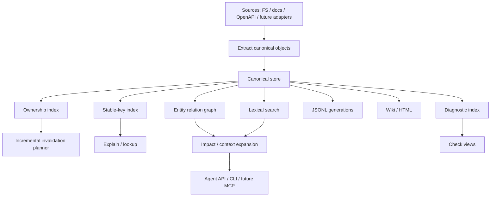

# Indexing Pipeline

Status: implemented, reusable app-layer pipeline with app-layer adapter registry, incremental merge, JSONL read-model writer, Markdown wiki projection, and static HTML reporting from canonical snapshots.

Athanor currently has a minimal but complete knowledge pipeline:

```text
SourceProvider
  -> Extractor
  -> Linker
  -> Checker
  -> JSONL KnowledgeStore
  -> JSONL, Markdown wiki, and HTML report read models
```

The CLI entry point is:

```bash
cargo run -p ath -- index .
cargo run -p ath -- index . --validate-only
```

## Target Architecture



## Current Flow

1. `athanor-source-fs` discovers project files and returns `SourceFile` values.
2. `athanor-extractor-basic` creates file entities and `file_discovered` facts.
3. `athanor-extractor-markdown` parses optional YAML frontmatter plus CommonMark/GFM heading events, then creates identity/language-aware documentation page/section entities and `doc_section_found` facts.
4. `athanor-extractor-openapi` dispatches OpenAPI 3.1 to `oas3` and 3.0 to a maintained-YAML legacy parser, then extracts operations, component schemas, request/response schema uses, and media examples.
5. `athanor-extractor-rust` parses Rust files into module, function, and symbol entities plus `symbol_defined` facts.
6. `athanor-linker-markdown` creates `contains` relations plus verified `documents` relations for exact entity/concept keys declared in Markdown frontmatter.
7. `athanor-linker-api` links OpenAPI operations to matching Rust handlers, Markdown API documentation, same-document request/response component schemas, and declared examples.
8. `athanor-checker-markdown` creates documentation structure, unresolved-reference, and duplicate-identity diagnostics.
9. `athanor-checker-api` diagnoses OpenAPI operations without linked implementations or documentation, local component schema references that did not resolve, and examples that violate their declared schemas.
10. `RuntimeBuilder` discovers adapter plugin manifests from `.athanor/adapters/*.json` and `.athanor/plugins/*/athanor-adapter.json`, then applies enabled adapter entries that match known app-layer factory ids.
11. `RuntimeBuilder` builds the configured `IndexPipeline` from an `AdapterRegistry`.
12. `IndexStateStore` classifies discovered files as changed, unchanged, or removed by comparing them with the previous state.
13. File additions or removals trigger a safe full rebuild so absence diagnostics cannot remain stale.
14. `IndexPipeline` extracts changed files only when a previous canonical snapshot is available from `CanonicalSnapshotStore`.
15. `IndexPipeline` carries unchanged canonical objects forward from the previous canonical snapshot, rewrites carried snapshot ids to the new snapshot, and drops objects whose ownership includes changed or removed paths.
16. `IndexPipeline` builds an affected subset from newly extracted objects, then passes it to linkers and checkers alongside the merged full context.
17. `IndexPipeline` validates newly emitted canonical objects for required evidence and ownership metadata.
18. If validation fails, `ath index` writes the aggregated adapter validation report to the configured validation report path.
19. In `--validate-only` mode, the CLI writes a structured validation result artifact for successful runs, then stops without persisting a canonical snapshot, read model, or index state.
20. Otherwise, `IndexPipeline` stores the merged canonical objects for the current run through `KnowledgeStore`.
21. `JsonlReadModelWriter` exports JSONL read models to `.athanor/generated/current/jsonl`.
22. `IndexStateStore` persists file hash state to `.athanor/state/index-state.json` for the next run.
23. On demand, `ath wiki` loads the latest durable canonical snapshot and performs a staged replacement of the neutral Markdown wiki read model.
24. On demand, `ath report html` loads the same snapshot and performs a staged replacement of a self-contained HTML report.
25. On demand, `ath generate` projects JSONL, wiki, and HTML into one immutable generation, writes a complete generation manifest, and then switches `current.json` to that generation.
26. On demand, `ath docs check` evaluates editable documentation under the configured path against frontmatter completeness and diagnostic severity policy.
27. On demand, `ath docs drift` reports editable documentation not verified against the latest canonical snapshot.
28. On demand, `ath api snapshot` publishes the latest API contract immutably and `ath api diff` compares contract snapshots.

## Pipeline Assembly

`athanor-app` now exposes:

- `IndexPipeline`: orchestration for source discovery, extraction, linking, checking, and store writes.
- `AdapterRegistry`: ordered factories for source, extractor, linker, and checker adapters.
- `RuntimeBuilder`: app-layer runtime assembly for a project root, registry, and discovered adapter plugin manifests.
- `JsonlReadModelWriter`: reusable JSONL export for generated read models.
- `JsonlKnowledgeStore`: durable local canonical snapshot store used by the CLI.
- `context_project`: task-focused context-pack generation from the latest canonical snapshot.
- `explain_project`: exact stable-key entity explanation from the latest canonical snapshot.
- `check_project`: scoped API/documentation diagnostic reporting from the latest canonical snapshot.
- `check_docs`: configurable editable-documentation completeness gate from the latest canonical snapshot.
- `docs_drift`: read-only editable-document verification-age report from the latest canonical snapshot.
- `snapshot_api_contract`: immutable endpoint/schema/example contract publication from the latest canonical snapshot.
- `diff_api_contracts`: deterministic comparison of two published API contract snapshots.
- `project_wiki`: Markdown wiki projection from the latest canonical snapshot.
- `project_html_report`: static HTML report projection from the latest canonical snapshot.
- `generate_project`: coordinated immutable JSONL/wiki/HTML generation and portable current-pointer publication.

## Markdown Wiki Projection

`ath wiki [path]` reads the latest durable canonical snapshot without re-indexing and invokes the built-in `MarkdownWikiProjector` through the core `Projector` port. It writes:

- a snapshot summary index
- one page per canonical entity
- one page per open diagnostic
- a versioned manifest with canonical object counts

Entity pages include source locations, matching facts, incoming and outgoing relations, and attached open diagnostics. Pages use neutral-language YAML frontmatter and stable entity or diagnostic ids as file names.

The complete projection is built in a temporary sibling directory, then renamed into place. The previous wiki is retained as a temporary backup until the swap succeeds, so readers never observe partially written pages. On platforms that cannot replace a non-empty directory in one operation, the target can be briefly absent during the swap. The wiki remains fully disposable and can be regenerated from the canonical store.

## HTML Report Projection

`ath report html [path]` reads the latest durable canonical snapshot without re-indexing and invokes `HtmlReportProjector` through the core `Projector` port. It writes a self-contained `index.html` and a versioned manifest under `.athanor/generated/current/html` by default.

The report shows snapshot metrics, complete open diagnostics, and a deterministic canonical entity table. Dynamic canonical values are HTML-escaped, presentation CSS is embedded, and the output has no network dependencies. The HTML and wiki adapters share canonical projection payload and staged directory publication utilities through `athanor-projector-support`.

## Coordinated Generated Generations

`ath generate [path]` loads the latest durable canonical snapshot once and builds all current read-model formats from that exact object set:

```text
.athanor/generated/generations/<generation>/
  manifest.json
  jsonl/
  wiki/
  html/
```

Generation ids are local zero-padded sequence numbers. The service builds the complete generation in a temporary sibling directory and publishes it with a single directory rename. Published generation directories are immutable and never replaced.

After publication, the service replaces `.athanor/generated/current.json` with an `athanor.generated_current.v1` document containing the generation id, snapshot id, relative generation path, and manifest path. The pointer is the final write, so any projector failure leaves the previous current generation selected. A pointer-write failure can leave a complete unreferenced generation, which is safe and can be collected later.

The JSON pointer is used instead of a filesystem symlink so publication works without elevated link privileges on Windows. Individual `ath index`, `ath wiki`, and `ath report html` commands continue to write direct compatibility outputs under `.athanor/generated/current`; only `ath generate` guarantees cross-format snapshot consistency.

## Context Pack Generation

`ath context <task>` reads the latest durable canonical snapshot without running indexing again. The initial context generator:

- tokenizes the task deterministically
- ranks canonical entities by matches in names, titles, stable keys, aliases, and source paths
- applies `summary`, `normal`, `deep`, or `full` presets for context size and relation depth
- accepts explicit token, file, entity, diagnostic, and relation-depth overrides
- expands direct matches by the configured number of relation hops
- includes diagnostics attached to selected entities
- returns stable file and entity scopes
- materializes selected entities, internal relations, and diagnostics in the JSON payload
- reports effective limits, approximate serialized token usage, omitted object counts, and whether relevance or limits caused omission in the JSON payload

The token budget is a deterministic estimate based on serialized canonical payload bytes divided by four; it is a size guard, not tokenizer-specific accounting. This remains an app-layer lexical slice rather than a `SearchIndex` implementation. Tantivy, vectors, and semantic ranking remain future adapters or services.

## Entity Explanation

`ath explain <stable-key>` reads one exact canonical entity from the latest durable snapshot without
re-indexing. The app-layer explanation includes:

- the full canonical entity and its source metadata
- facts where the entity is either subject or object
- outgoing and incoming relations, each resolved to the neighboring entity when available
- diagnostics attached to the entity
- the snapshot id and `athanor.entity_explanation.v1` response schema

The default CLI output is a compact directional summary. `--json` returns the complete explanation,
including canonical evidence, confidence, status, ownership, and payload fields. Stable-key lookup is
exact and currently explains one canonical entity at a time.

## Diagnostic Check Views

`ath check api` and `ath check docs` read open diagnostics from the latest durable canonical snapshot
without re-indexing. The app layer classifies diagnostic kinds into API and documentation scopes,
sorts results by severity and diagnostic id, and returns:

- snapshot id and requested scope
- total, critical, high, medium, and low counts
- complete canonical diagnostic objects

The default CLI output is a compact source-oriented list. `--json` emits the
`athanor.diagnostic_check.v1` report. These commands are currently read-only views and return success
after a valid query even when diagnostics exist; CI failure thresholds and strict-mode policy remain
deferred.

## Editable Documentation Completeness Gate

`ath docs check` is a read-only CI gate over the latest durable snapshot. It reads `[docs]` and
`[docs.completeness]` from `athanor.toml`, selects only `documentation_layer = "editable"` pages
under `docs.editable_path`, and fails when required frontmatter fields are absent, status is not
allowed, current-snapshot verification is required but stale, or matching open documentation
diagnostics meet the configured severity threshold. `--json` emits the stable
`athanor.docs_check.v1` report before returning a non-zero exit status on failure.

The gate does not re-index or modify documentation. Generated documentation is excluded even when
it is present in a canonical snapshot.

`ath docs drift` uses the same editable path selection but does not apply status, required-field,
or diagnostic thresholds. It reports pages with a missing or non-current `last_verified_snapshot`;
`--json` emits `athanor.docs_drift.v1`. Drift is informational and does not produce a failing exit
status.

## API Contract Snapshots

`ath api snapshot` selects canonical `ApiEndpoint`, `ApiSchema`, and `ApiExample` entities from the
latest durable snapshot, sorts them by stable key, and writes an immutable
`.athanor/api/snapshots/<snapshot>.json` contract. Repeating the command for the same canonical
snapshot reuses the file only when its content is identical. The portable `.athanor/api/latest.json`
pointer is replaced atomically after publication.

`ath api diff --from <snapshot> --to <snapshot>` compares two published contracts. When ids are
omitted, it compares the latest two snapshots. Breaking endpoint rules cover removed endpoints or
status codes and changed method, path, security, request-schema, or response-schema declarations.
Breaking schema rules cover schema/property type changes, removed properties, and required-set
changes. Description-only changes, optional property additions, additions, and example changes are
informational. Every breaking change carries machine-readable reasons.

`ath api breaking-changes` evaluates the same diff and returns a non-zero exit status when any
breaking change exists, making it suitable for CI once a baseline snapshot is available. The gate
does not mutate canonical storage. Every comparison persists a versioned diff artifact under
`.athanor/api/diffs/<from>--<to>.json`. Breaking entries include evidence-backed, ownership-aware
`api_breaking_change_detected` domain diagnostics. Contract snapshot v2 retains entity identity,
source, and ownership; comparisons with older v1 snapshots fall back to the immutable snapshot
artifact itself as evidence.

`ath check api --strict` combines open diagnostics from the latest canonical snapshot with the
latest API contract comparison. It returns a non-zero exit status when either side has findings.
Without `--strict`, `ath check api` remains the existing read-only diagnostic view.

The default built-in registry currently assembles:

```text
store:
  JsonlKnowledgeStore

sources:
  LocalFileSystemSource

extractors:
  FileExtractor
  MarkdownExtractor
  OpenApiExtractor
  RustExtractor

linkers:
  MarkdownContainmentLinker
  ApiKnowledgeLinker

checkers:
  MarkdownStructureChecker
  ApiConsistencyChecker
```

`ath index` is responsible for CLI-facing concerns:

- canonicalizing the project root
- creating the default runtime builder
- choosing the generated JSONL output path
- loading and saving persisted index state
- reporting changed, unchanged, and removed file counts
- calling the read-model writer
- loading the previous canonical snapshot from the durable store
- writing adapter validation reports to `.athanor/generated/current/validation-report.json` or the `--validation-report` path when validation fails
- writing successful validation-only result JSON to `.athanor/generated/current/validation-result.json` or the `--validation-result` path
- supporting `--validate-only` for adapter contract validation without writing snapshots, state, or read models

`RuntimeBuilder` and `AdapterRegistry` are responsible for adapter assembly:

- keeping the built-in adapter list out of CLI code
- discovering adapter plugin manifests from `.athanor/adapters/*.json` and `.athanor/plugins/*/athanor-adapter.json`
- applying enabled manifest entries that map to known app-layer adapter factory ids
- loading external process sources, extractors, linkers, and checkers from manifest `command` entries
- preserving adapter order
- allowing tests, daemon code, and future plugins to share the same assembly point

`IndexPipeline` is responsible for orchestration:

- discovering sources
- classifying affected files from persisted state
- running extractors for changed files when a previous canonical snapshot is available
- falling back to full extraction when the previous canonical snapshot is missing
- merging unchanged canonical objects from the previous canonical snapshot
- pruning carried canonical objects by explicit ownership metadata, with source/evidence fallback for older snapshots
- deriving the affected subset from newly extracted objects for downstream adapters
- running linkers over the affected subset with full merged context available
- running checkers over the affected subset with full merged context available
- validating newly emitted entities/facts/relations/diagnostics before storage
- aggregating adapter validation failures by adapter, object type, object id, and missing metadata field
- stopping before durable writes when the CLI requested validation-only mode
- storing entities/facts/relations/diagnostics
- committing the snapshot

`JsonlReadModelWriter` is responsible for generated read models:

- writing `entities.jsonl`, `facts.jsonl`, `relations.jsonl`, and `diagnostics.jsonl`
- writing `manifest.json`
- keeping JSONL and manifest behavior reusable outside CLI indexing

## Generated Files

```text
.athanor/generated/current/jsonl/
  entities.jsonl
  facts.jsonl
  relations.jsonl
  diagnostics.jsonl
  manifest.json

.athanor/generated/current/wiki/
  index.md
  manifest.json
  entities/<entity-id>.md
  diagnostics/<diagnostic-id>.md

.athanor/generated/current/html/
  index.html
  manifest.json

.athanor/generated/current.json

.athanor/generated/generations/<generation>/
  manifest.json
  jsonl/
  wiki/
  html/

.athanor/generated/current/
  validation-report.json
  validation-result.json

.athanor/adapters/
  <adapter-plugin>.json

.athanor/plugins/
  <plugin-name>/athanor-adapter.json

.athanor/state/
  index-state.json

.athanor/store/canonical/jsonl/
  latest.json
  snapshots/<snapshot-id>/

.athanor/api/
  latest.json
  snapshots/<snapshot-id>.json
  diffs/<from>--<to>.json
```

Generated JSONL files and Markdown wiki pages under `.athanor/generated/current` are read models. They are not the source of truth and may be deleted and rebuilt. `validation-report.json` is written only for adapter contract validation failures and is removed after a successful index run. `validation-result.json` is written only for successful `--validate-only` runs and is removed after validation failures or normal index runs. Durable canonical snapshots live under `.athanor/store/canonical/jsonl`. The state file records the last indexed file paths, content hashes, language hints, and snapshot id so later runs can classify changed, unchanged, and removed files. Its schema is versioned so changes to built-in extraction, linking, or checking semantics can force a safe one-time full rebuild; OpenAPI example extraction and validation advance it to `athanor.index_state.v12`.

## Current Limitations

- Process source adapters perform a full discovery request per indexing run; streaming discovery and source-level change feeds are not implemented.
- Context generation uses deterministic lexical matching and approximate token accounting; model-specific tokenizers and semantic search are not implemented.
- Entity explanation requires an exact stable key and does not yet provide fuzzy lookup, history, or cross-snapshot comparison.
- Diagnostic check views expose open findings; API strict mode adds a CI threshold and historical contract comparison, while per-kind suppression remains deferred.
- The completeness gate has a project-level severity threshold but does not yet support per-kind suppressions or baseline comparison.
- Rust extraction does not expand macros, emit trait method declarations, or infer imports, calls, and framework routes.
- OpenAPI extraction supports 3.0.x and 3.1.x through replaceable parser backends but does not support Swagger 2.x/OpenAPI 3.2, resolve external references, merge specifications, or infer code handlers. Example validation is offline and covers media-type inline/named values; external and schema-level examples remain deferred.
- API knowledge linking is lexical for code/docs and resolves only same-document component schemas; framework route metadata, call graphs, and Rust schema/type links are not implemented.
- API consistency diagnostics check unresolved local component schema references but do not compare schema fields with Rust types or check status codes, auth, or permissions yet.
- The current CLI still performs a full source discovery pass before classifying changed files.
- The JSONL canonical store is a local development store, not a concurrent multi-process database.
- Older canonical snapshots without ownership metadata are pruned by entity source paths and evidence source files.
- Frontmatter references resolve by exact stable key only; aliases, fuzzy matching, external concept registries, and reference-type constraints are not implemented.
- Wiki and HTML projection currently rebuild complete outputs and are selected directly by app services rather than projector plugin discovery.
- The HTML report is a static overview without client-side filtering or per-entity detail pages.
- Generation numbering and pointer updates are local single-process operations; concurrent generation publishers and garbage collection are not implemented.
- Direct compatibility outputs under `.athanor/generated/current` are not coordinated; consumers requiring one snapshot must use `current.json` and `generations/`.

## Next Good Step

Add the API registry view and explicit source-of-truth policy enforcement.
