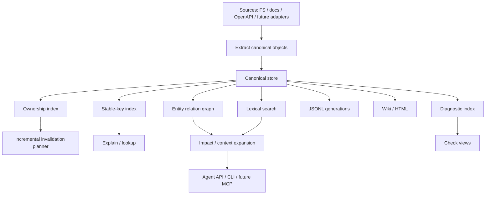

# Indexing Pipeline

Status: implemented, reusable app-layer pipeline with app-layer adapter registry, incremental merge, JSONL read-model writer, Markdown wiki projection, and static HTML reporting from canonical snapshots.

Athanor currently has a minimal but complete knowledge pipeline:

```text
SourceProvider
  -> Extractor
  -> Linker
  -> Checker
  -> JSONL KnowledgeStore
  -> JSONL, Markdown wiki, and HTML report read models
```

The CLI entry point is:

```bash
cargo run -p ath -- index .
cargo run -p ath -- index . --validate-only
```

## Target Architecture



## Current Flow

1. `athanor-source-fs` discovers project files and returns `SourceFile` values.
2. `athanor-extractor-basic` creates file entities and `file_discovered` facts.
3. `athanor-extractor-markdown` parses optional YAML frontmatter plus CommonMark/GFM heading events, then creates identity/language-aware documentation page/section entities, runbook entities for runbook frontmatter, operation-step entities for runbook ordered-list items, and `doc_section_found` facts.
4. `athanor-extractor-openapi` dispatches project OpenAPI 3.1 to `oas3` and 3.0 to a maintained-YAML legacy parser, ignores OpenAPI files under `tests/fixtures` during project discovery, then extracts operations, component schemas, request/response schema uses, and media examples.
5. `athanor-extractor-operations` parses dotenv, Cargo manifest, Makefile, Dockerfile, shell script, docker-compose, GitHub Actions, Kubernetes YAML, SQL migration, and runtime config sources into environment-variable, package/dependency, script-command, deployment/service, database migration, and runtime configuration knowledge.
6. `athanor-extractor-rust` parses Rust files into module, function, symbol, and environment-variable entities plus `symbol_defined` and `env_var_used` facts.
7. `athanor-linker-markdown` creates `contains` relations plus verified `documents` relations for exact entity/concept keys declared in Markdown frontmatter.
8. `athanor-linker-api` links OpenAPI operations to matching Rust handlers, Markdown API documentation, same-document request/response component schemas, and declared examples.
9. `athanor-checker-markdown` creates documentation structure, unresolved-reference, and duplicate-identity diagnostics.
10. `athanor-checker-api` diagnoses OpenAPI operations without linked implementations or documentation, local component schema references that did not resolve, examples that violate their declared schemas, undocumented environment variables, undocumented runtime configuration keys, undocumented script commands, undocumented deployment resources, runbooks not tied to operational knowledge, runbooks without operation steps, and runbook steps that do not cover declared operational targets.
11. `RuntimeBuilder` discovers adapter plugin manifests from `.athanor/adapters/*.json` and `.athanor/plugins/*/athanor-adapter.json`, then applies enabled adapter entries that match known app-layer factory ids.
12. `RuntimeBuilder` builds the configured `IndexPipeline` from an `AdapterRegistry`.
13. `IndexStateStore` classifies discovered files as changed, unchanged, or removed by comparing them with the previous state.
14. File additions or removals trigger a safe full rebuild so absence diagnostics cannot remain stale.
15. `IndexPipeline` extracts changed files only when a previous canonical snapshot is available from `CanonicalSnapshotStore`; extractor/source-file tasks run concurrently with a fixed limit of 16 in-flight tasks.
16. `IndexPipeline` carries unchanged canonical objects forward from the previous canonical snapshot, rewrites carried snapshot ids to the new snapshot, drops objects whose ownership includes changed or removed paths, and canonicalizes merged objects by id so duplicated carried/new objects cannot persist in the next snapshot.
17. `IndexPipeline` builds an affected subset from newly extracted objects, then passes it to linkers and checkers alongside the merged full context. In-process linker and checker inputs share full-context entity, fact, and relation lists through `Arc<[T]>` to avoid cloning the complete lists per adapter.
18. `IndexPipeline` validates newly emitted canonical objects for required evidence and ownership metadata.
19. If validation fails, `ath index` writes the aggregated adapter validation report to the configured validation report path.
20. In `--validate-only` mode, the CLI writes a structured validation result artifact for successful runs, then stops without persisting a canonical snapshot, read model, or index state.
21. Otherwise, `IndexPipeline` stores the merged canonical objects for the current run through `KnowledgeStore`.
22. `JsonlReadModelWriter` exports JSONL read models to `.athanor/generated/current/jsonl`.
23. `IndexStateStore` persists file hash state to `.athanor/state/index-state.json` for the next run.
24. On demand, `ath wiki` loads the latest durable canonical snapshot and performs a staged replacement of the neutral Markdown wiki read model.
25. On demand, `ath report html` loads the same snapshot and performs a staged replacement of a self-contained HTML report.
26. On demand, `ath generate` projects JSONL, wiki, and HTML into one immutable generation, writes a complete generation manifest, and then switches `current.json` to that generation.
27. On demand, `ath check env` reports environment variables used by Rust code or declared in operations/config files, plus runtime configuration keys, that are not linked from editable documentation.
28. On demand, `ath check scripts` reports operational script commands not linked from editable documentation.
29. On demand, `ath check deployment` reports deployment and service resources not linked from editable documentation.
30. On demand, `ath check runbooks` reports runbooks that do not reference known operational targets or have no extracted operation steps.
31. On demand, `ath update --changed` runs the same incremental indexing path through an explicit update command, writes a new durable snapshot, refreshes JSONL read models, and updates persisted file change state.
32. On demand, `ath check affected` compares current source discovery with persisted index state and reports latest-snapshot diagnostics plus stale local artifact status for changed workflows without writing a new snapshot.
33. On demand, `ath context --diff` builds a bounded context pack rooted in entities owned by changed or removed files without writing a new snapshot.
34. On demand, `ath repair inspect` validates local canonical and generated pointers, manifests, and orphaned immutable artifacts without modifying files.
35. On demand, `ath repair cleanup` removes orphaned immutable canonical snapshots and generated generations identified by repair inspection.
36. On demand, `ath repair regenerate` publishes a fresh coordinated generated generation when the current generated pointer is stale, missing, or invalid.
37. On demand, `ath repair recover-canonical` repoints a missing or invalid canonical latest pointer to the newest valid local canonical snapshot.
38. On demand, `ath repair apply` runs canonical recovery, generated regeneration, and orphan cleanup in deterministic order.
39. On demand, `ath docs operations check` aggregates environment, script, deployment, and runbook documentation diagnostics and fails when any are open.
40. On demand, `ath docs check` evaluates editable documentation under the configured path against frontmatter completeness and diagnostic severity policy.
41. On demand, `ath docs drift` reports editable documentation not verified against the latest canonical snapshot.
42. On demand, `ath docs propose-fix` writes a reviewable JSON patch proposal for editable documentation frontmatter policy and drift findings.
43. On demand, `ath docs apply-patch <id-or-path>` explicitly applies one generated documentation patch proposal after verifying it still targets the latest canonical snapshot.
44. On demand, `ath api snapshot` publishes the latest API contract immutably and `ath api diff` compares contract snapshots.

## Pipeline Assembly

`athanor-app` now exposes:

- `IndexPipeline`: orchestration for source discovery, extraction, linking, checking, and store writes.
- `AdapterRegistry`: ordered factories for source, extractor, linker, and checker adapters.
- `RuntimeBuilder`: app-layer runtime assembly for a project root, registry, and discovered adapter plugin manifests.
- `JsonlReadModelWriter`: reusable JSONL export for generated read models.
- `JsonlKnowledgeStore`: durable local canonical snapshot store used by the CLI.
- `overview_project`: bounded repository orientation from the latest canonical snapshot.
- `context_project`: task-focused context-pack generation from the latest canonical snapshot.
- `explain_project`: exact stable-key entity explanation from the latest canonical snapshot.
- `export_graph`: bounded JSON graph export from the latest canonical snapshot.
- `related_graph`: bounded related-entity exploration from one exact stable key.
- `shortest_graph_path`: bounded shortest-path search between two exact stable keys.
- `check_project`: scoped API, documentation, environment, script, deployment, and runbook diagnostic reporting from the latest canonical snapshot.
- `check_affected`: read-only changed-file diagnostic reporting from latest canonical snapshot plus persisted index state.
- `check_operations_docs`: aggregate environment, script, deployment, and runbook documentation diagnostics from one latest canonical snapshot load.
- `check_docs`: configurable editable-documentation completeness gate from the latest canonical snapshot.
- `docs_drift`: read-only editable-document verification-age report from the latest canonical snapshot.
- `docs_propose_fix`: patch-proposal generation for deterministic editable-document frontmatter remediation.
- `docs_apply_patch`: explicit patch application for generated documentation proposals.
- `snapshot_api_contract`: immutable endpoint/schema/example contract publication from the latest canonical snapshot.
- `diff_api_contracts`: deterministic comparison of two published API contract snapshots.
- `project_wiki`: Markdown wiki projection from the latest canonical snapshot.
- `project_html_report`: static HTML report projection from the latest canonical snapshot.
- `generate_project`: coordinated immutable JSONL/wiki/HTML generation and portable current-pointer publication.
- `inspect_repair`: read-only local artifact pointer and manifest inspection.
- `cleanup_repair`: deterministic orphan canonical snapshot and generated generation cleanup.
- `regenerate_repair`: deterministic stale or missing generated-current repair through coordinated generation.
- `recover_canonical_repair`: deterministic canonical latest-pointer recovery from local valid snapshots.
- `apply_repair`: deterministic orchestration of canonical recovery, generated regeneration, and orphan cleanup.

## Markdown Wiki Projection

`ath wiki [path]` reads the latest durable canonical snapshot without re-indexing and invokes the built-in `MarkdownWikiProjector` through the core `Projector` port. It writes:

- a snapshot summary index
- one page per canonical entity
- one page per open diagnostic
- a versioned manifest with canonical object counts

Entity pages include source locations, matching facts, incoming and outgoing relations, and attached open diagnostics. Pages use neutral-language YAML frontmatter and stable entity or diagnostic ids as file names.

The complete projection is built in a temporary sibling directory, then renamed into place. The previous wiki is retained as a temporary backup until the swap succeeds, so readers never observe partially written pages. On platforms that cannot replace a non-empty directory in one operation, the target can be briefly absent during the swap. The wiki remains fully disposable and can be regenerated from the canonical store.

## HTML Report Projection

`ath report html [path]` reads the latest durable canonical snapshot without re-indexing and invokes `HtmlReportProjector` through the core `Projector` port. It writes a self-contained `index.html` and a versioned manifest under `.athanor/generated/current/html` by default.

The report shows snapshot metrics, complete open diagnostics, and a deterministic canonical entity table. Dynamic canonical values are HTML-escaped, presentation CSS is embedded, and the output has no network dependencies. The HTML and wiki adapters share canonical projection payload and staged directory publication utilities through `athanor-projector-support`.

## Coordinated Generated Generations

`ath generate [path]` loads the latest durable canonical snapshot once and builds all current read-model formats from that exact object set:

```text
.athanor/generated/generations/<generation>/
  manifest.json
  jsonl/
  wiki/
  html/
```

Generation ids are local zero-padded sequence numbers. The service builds the complete generation in a temporary sibling directory and publishes it with a single directory rename. Published generation directories are immutable and never replaced.

After publication, the service replaces `.athanor/generated/current.json` with an `athanor.generated_current.v1` document containing the generation id, snapshot id, relative generation path, and manifest path. The pointer is the final write, so any projector failure leaves the previous current generation selected. A pointer-write failure can leave a complete unreferenced generation, which is safe and can be collected later.

The JSON pointer is used instead of a filesystem symlink so publication works without elevated link privileges on Windows. Individual `ath index`, `ath wiki`, and `ath report html` commands continue to write direct compatibility outputs under `.athanor/generated/current`; only `ath generate` guarantees cross-format snapshot consistency.

## Repair Inspection

`ath repair inspect [path]` is a read-only consistency check for local Athanor artifacts. It inspects
the JSONL canonical store pointer, canonical snapshot manifests, generated generation pointer,
generation manifests, and immutable artifact directories. The command reports:

- the latest canonical snapshot selected by `.athanor/store/canonical/jsonl/latest.json`
- canonical snapshot directories not selected by the latest pointer
- the current generated generation selected by `.athanor/generated/current.json`
- generated generation directories not selected by the current pointer
- invalid JSON, unsupported schemas, missing pointed-to directories, and stale generated outputs built from an older canonical snapshot

`--json` emits `athanor.repair_inspect.v1`. The command does not delete, rewrite, or repoint any
artifact.

`ath repair cleanup [path]` consumes the same inspection logic and removes only unselected immutable
artifact directories:

- canonical snapshot directories not selected by `.athanor/store/canonical/jsonl/latest.json`
- generated generation directories not selected by `.athanor/generated/current.json`

`--dry-run` reports planned removals without deleting files. `--keep-canonical <N>` and
`--keep-generated <N>` retain the newest N orphan canonical snapshots or generated generations while
still allowing older orphans to be removed. `--json` emits `athanor.repair_cleanup.v1`, including
the initial inspection, removed or planned removals, retained artifacts, and remaining issues after
cleanup. The command does not rewrite pointers, regenerate stale outputs, or remove the current
canonical snapshot or current generated generation.

`ath repair regenerate [path]` repairs generated-current selection issues by running the same
coordinated generation path as `ath generate`. It publishes a new immutable generation from the
latest canonical snapshot and updates `.athanor/generated/current.json` only after JSONL, wiki, and
HTML outputs succeed. It runs only when inspection reports a stale, missing, or invalid generated
current pointer, when the pointer references a missing generation directory, when pointer path
fields do not match the expected generation layout, or when the selected generation manifest is
missing, invalid, or disagrees with the current pointer. `--dry-run` reports whether regeneration is
needed without writing outputs. `--json` emits `athanor.repair_regenerate.v1`, including the initial
inspection, the published generation when one was created, and remaining issues. Old generated
generations become cleanup candidates and are removed only by `ath repair cleanup`.

`ath repair recover-canonical [path]` repairs a missing, invalid, or dangling
`.athanor/store/canonical/jsonl/latest.json` pointer. It scans local canonical snapshot directories,
selects the newest snapshot whose manifest has the supported schema and matching snapshot id, and
atomically rewrites only `latest.json`. `--dry-run` reports the selected snapshot without writing.
`--json` emits `athanor.repair_recover_canonical.v1`, including the initial inspection, selected
snapshot, recovered snapshot when written, and remaining issues. The command does not create,
modify, or delete canonical snapshot directories.

`ath repair apply [path]` runs the deterministic repair stages in order:

1. canonical latest-pointer recovery
2. coordinated generated-current regeneration
3. orphan canonical snapshot and generated generation cleanup

`--dry-run` returns the planned stage reports without writing or deleting artifacts. Without
`--dry-run`, the command may delete orphan canonical snapshots and orphan generated generations
through the same rules as `ath repair cleanup`. `--keep-canonical <N>` and `--keep-generated <N>`
are passed to the cleanup stage. `--json` emits `athanor.repair_apply.v1`, including each stage
report and final remaining issues.

## Context Pack Generation

`ath overview [path]` reads the latest durable canonical snapshot without re-indexing and returns a
bounded repository orientation report. The app-layer report includes canonical object totals, top
entity and relation kinds, top source roots, API/documentation/operations counters, graph hubs by
relation degree, module summaries ranked by direct `defines`/`contains` members, cross-source-root
integration boundaries with canonical relation ids, and compact open diagnostic summaries.
All ranked sections use the command's `--top` bound. `--json` emits the stable
`athanor.overview.v1` payload. The text output is intended as a quick agent/developer starting
point before using `ath context`, `ath explain`, or `ath impact` for narrower questions.

`ath context <task>` reads the latest durable canonical snapshot without running indexing again. `ath context --diff` also reads the latest snapshot, compares current source discovery with `.athanor/state/index-state.json`, and uses entities from changed or removed files as direct context roots without committing a new snapshot. The initial context generator:

- tokenizes the task deterministically
- ranks canonical entities by matches in names, titles, stable keys, aliases, and source paths
- applies `summary`, `normal`, `deep`, or `full` presets for context size and relation depth
- accepts explicit token, file, entity, diagnostic, and relation-depth overrides
- expands direct matches by the configured number of relation hops
- includes diagnostics attached to selected entities
- returns stable file and entity scopes
- materializes selected entities, internal relations, and diagnostics in the JSON payload
- records diff changed/unchanged/removed file counts when invoked with `--diff`
- reports effective limits, approximate serialized token usage, omitted object counts, and whether relevance or limits caused omission in the JSON payload

The token budget is a deterministic estimate based on serialized canonical payload bytes divided by four; it is a size guard, not tokenizer-specific accounting. This remains an app-layer lexical slice rather than a `SearchIndex` implementation. Tantivy, vectors, and semantic ranking remain future adapters or services.

`ath graph export --format json` reads the latest durable canonical snapshot without re-indexing and
emits a bounded disposable graph read model. The JSON payload uses schema
`athanor.graph_export.v1`, ranks nodes by relation degree and stable key for deterministic output,
keeps edge evidence source anchors, and reports omitted node/edge counts when `--max-entities` or
`--max-relations` limits truncate the export. The export is derived from canonical entities and
relations only; it does not replace canonical storage and does not write generated artifacts.

`ath graph related <stable-key>` performs a deterministic breadth-first traversal over incoming and
outgoing canonical relations. `--depth`, `--max-entities`, and `--max-relations` bound the result.
Text output provides compact agent-oriented navigation; `--json` emits
`athanor.graph_related.v1`, including canonical entity ids, stable keys, relation ids, relation
status and confidence, evidence anchors, per-node distance, and a truncation flag. The command
requires an exact stable key, reads only the latest canonical snapshot, and does not write
artifacts.

`ath graph path <from-stable-key> <to-stable-key>` finds one deterministic shortest path while
treating canonical relations as traversable in either direction. The returned relation objects
retain their canonical direction, ids, status, confidence, and evidence anchors. `--max-depth` and
`--max-visited` bound search work; reports distinguish a complete no-path result from a truncated
search. `--json` emits `athanor.graph_path.v1` with the endpoint entities, ordered path nodes and
edges, hop count, visited entity count, and truncation state. Missing endpoint stable keys are
lookup errors. The command reads the latest canonical snapshot without writing artifacts.

## Entity Explanation

`ath explain <stable-key>` reads one exact canonical entity from the latest durable snapshot without
re-indexing. The app-layer explanation includes:

- the full canonical entity and its source metadata
- facts where the entity is either subject or object
- outgoing and incoming relations, each resolved to the neighboring entity when available
- diagnostics attached to the entity
- the snapshot id and `athanor.entity_explanation.v1` response schema

The default CLI output is a compact directional summary. `--json` returns the complete explanation,
including canonical evidence, confidence, status, ownership, and payload fields. Stable-key lookup is
exact and currently explains one canonical entity at a time.

## Diagnostic Check Views

`ath check api`, `ath check docs`, `ath check env`, `ath check scripts`, `ath check deployment`, and `ath check runbooks` read open diagnostics from the latest durable
canonical snapshot without re-indexing. The app layer classifies diagnostic kinds into API,
documentation, environment, script, deployment, and runbook scopes, sorts results by severity and diagnostic id, and returns:

- snapshot id and requested scope
- total, critical, high, medium, and low counts
- complete canonical diagnostic objects

The default CLI output is a compact source-oriented list. `--json` emits the
`athanor.diagnostic_check.v1` report. `ath check env` selects `missing_env_var` diagnostics produced
from canonical `EnvVar` entities and `documents` relations, plus scoped `missing_documentation`
diagnostics for runtime configuration keys. `ath check scripts` selects
`missing_documentation` diagnostics whose payload scope is `scripts`, produced from canonical
`ScriptCommand` entities and `documents` relations. `ath check deployment` selects
`missing_documentation` diagnostics whose payload scope is `deployment`, produced from canonical
`DockerService` entities and `documents` relations. `ath check runbooks` selects scoped
`stale_documentation` diagnostics produced from canonical `Runbook` entities whose declared
operation targets do not resolve to known operational entities, whose body has no extracted
ordered-list operation steps, or whose extracted steps do not mention any declared operational
target. These commands are currently read-only views and
return success after a valid query even when diagnostics exist; CI failure thresholds and
strict-mode policy remain deferred outside API strict mode.

`ath update --changed` is the writable changed-file workflow. It calls the same app-layer indexing
service as `ath index`, uses the persisted index state to classify changed, unchanged, and removed
files, writes a fresh canonical snapshot, refreshes `.athanor/generated/current/jsonl`, and updates
`.athanor/state/index-state.json` after success. The command requires `--changed` so accidental
full-style update entrypoints stay explicit; `--json` emits the serialized index report.

`ath check affected` is a read-only changed-file diagnostic and artifact-status view. It loads the
latest canonical snapshot, reads `.athanor/state/index-state.json`, discovers current source files,
and compares the current file hashes with the last committed index state. Open diagnostics are
selected when they touch changed or removed files through attached entity ids, ownership metadata,
or evidence source files. Editable documentation drift is reported only for affected documents
whose `last_verified_snapshot` differs from the latest canonical snapshot. The same report also
inspects local generated artifacts without modifying them: `.athanor/generated/current.json`,
immutable generated generations, direct wiki and HTML report manifests under
`.athanor/generated/current`, `.athanor/api/latest.json`, and existing API diff directories.
`--json` emits `athanor.affected_check.v1` with affected file counts, matching diagnostics,
affected `documentation_drift`, and `stale_artifacts` entries with suggested explicit commands.
The command does not run extraction, linking, checking, regeneration, repair apply, cleanup,
documentation patching, or write a new snapshot.

## Editable Documentation Completeness Gate

`ath docs check` is a read-only CI gate over the latest durable snapshot. It reads `[docs]` and
`[docs.completeness]` from `athanor.toml`, selects only `documentation_layer = "editable"` pages
under `docs.editable_path`, and fails when required frontmatter fields are absent, status is not
allowed, current-snapshot verification is required but stale, or matching open documentation
diagnostics meet the configured severity threshold. `--json` emits the stable
`athanor.docs_check.v1` report before returning a non-zero exit status on failure.

The gate does not re-index or modify documentation. Generated documentation is excluded even when
it is present in a canonical snapshot.

`ath docs drift` uses the same editable path selection but does not apply status, required-field,
or diagnostic thresholds. It reports pages with a missing or non-current `last_verified_snapshot`;
`--json` emits `athanor.docs_drift.v1`. Drift is informational and does not produce a failing exit
status.

`ath docs operations check` reads the latest durable snapshot once and aggregates the same
environment, script, deployment, and runbook diagnostics exposed by the scoped `ath check`
commands. Text output prints the operational total and then each scoped diagnostic report. `--json`
emits `athanor.operations_docs_check.v1` with total counts plus the four per-scope reports. The
command is read-only and returns a non-zero process status when any operational documentation
diagnostic remains open.

`ath docs propose-fix` reads the same latest snapshot and writes an `athanor.docs_patch.v1` JSON
proposal under `.athanor/patches/docs/` by default. The current proposal generator is intentionally
deterministic. It covers Markdown frontmatter remediation for policy and drift findings, and creates
reviewable Markdown API page drafts for `api_endpoint_implemented_but_not_documented` diagnostics.
Generated API pages include frontmatter `entities` declarations that point at the missing endpoint,
so a later index can convert the reviewed page into a canonical `documents` relation. API drafts use
the canonical API graph when available: linked Rust handlers, request and response schema
relations, examples, response codes, tags, security payloads, and diagnostic evidence are included
without re-parsing source files. Existing editable API documentation pages that already declare or
link to endpoints receive proposed endpoint-specific Athanor-managed contract block updates;
human-authored content outside those blocks is preserved, and the source file is changed only after
explicit `docs apply-patch`. When an editable API page is linked to an endpoint only through
canonical documentation relations, the same proposal can add the endpoint stable key to frontmatter
`entities` so future indexes retain an exact declared reference. When one endpoint is documented by
multiple editable API pages, the proposal also refreshes a generated coordination block that lists
the related pages for review before application. The same pass strips existing Athanor-managed
blocks, scans the remaining human-authored API page text for `METHOD /path` route mentions, and
adds a narrative review block when those mentions no longer match the current endpoints linked to
the page. When the page has exactly one linked current endpoint, the same block includes a
reviewable narrative rewrite draft that shows the original line and a deterministic route
replacement without directly rewriting the human-authored paragraph.
It also creates reviewable operations documentation drafts for `missing_env_var`, scoped runtime
configuration `missing_documentation`, scoped script `missing_documentation`, scoped deployment
`missing_documentation`, and scoped runbook `stale_documentation` diagnostics under the editable
documentation operations path, using frontmatter `entities` declarations that point at the missing
or stale operational stable key.

`ath docs apply-patch <patch-id-or-path>` applies one proposal explicitly. Apply verifies that the
proposal snapshot equals the current canonical snapshot before rewriting or creating editable
Markdown files. Create operations refuse to overwrite existing paths. This preserves the rule that
generated documentation tooling may propose changes, but editable docs are not silently overwritten.

## API Contract Snapshots

`ath api snapshot` selects canonical `ApiEndpoint`, `ApiSchema`, and `ApiExample` entities from the
latest durable snapshot, sorts them by stable key, and writes an immutable
`.athanor/api/snapshots/<snapshot>.json` contract. Repeating the command for the same canonical
snapshot reuses the file only when its content is identical. The portable `.athanor/api/latest.json`
pointer is replaced atomically after publication.

`ath api diff --from <snapshot> --to <snapshot>` compares two published contracts. When ids are
omitted, it compares the latest two snapshots. Breaking endpoint rules cover removed endpoints or
status codes and changed method, path, security, request-schema, or response-schema declarations.
Breaking schema rules cover schema/property type changes, removed properties, and required-set
changes. Description-only changes, optional property additions, additions, and example changes are
informational. Every breaking change carries machine-readable reasons.

`ath api breaking-changes` evaluates the same diff and returns a non-zero exit status when any
breaking change exists, making it suitable for CI once a baseline snapshot is available. The gate
does not mutate canonical storage. Every comparison persists a versioned diff artifact under
`.athanor/api/diffs/<from>--<to>.json`. Breaking entries include evidence-backed, ownership-aware
`api_breaking_change_detected` domain diagnostics. Contract snapshot v2 retains entity identity,
source, and ownership; comparisons with older v1 snapshots fall back to the immutable snapshot
artifact itself as evidence.

`ath check api --strict` combines open diagnostics from the latest canonical snapshot with the
latest API contract comparison. It returns a non-zero exit status when either side has findings.
Without `--strict`, `ath check api` remains the existing read-only diagnostic view.

The default built-in registry currently assembles:

```text
store:
  JsonlKnowledgeStore

sources:
  LocalFileSystemSource

extractors:
  FileExtractor
  MarkdownExtractor
  OpenApiExtractor
  OperationsExtractor
  RustExtractor

linkers:
  MarkdownContainmentLinker
  ApiKnowledgeLinker

checkers:
  MarkdownStructureChecker
  ApiConsistencyChecker
  EnvDocsChecker
  ScriptDocsChecker
  DeploymentDocsChecker
  RunbookConsistencyChecker
```

`ath index` is responsible for CLI-facing concerns:

- canonicalizing the project root
- creating the default runtime builder
- choosing the generated JSONL output path
- loading and saving persisted index state
- reporting changed, unchanged, and removed file counts
- calling the read-model writer
- loading the previous canonical snapshot from the durable store
- writing adapter validation reports to `.athanor/generated/current/validation-report.json` or the `--validation-report` path when validation fails
- writing successful validation-only result JSON to `.athanor/generated/current/validation-result.json` or the `--validation-result` path
- supporting `--validate-only` for adapter contract validation without writing snapshots, state, or read models
- initializing standard tracing output; detailed indexing logs can be enabled with `RUST_LOG=athanor_app=info`

`RuntimeBuilder` and `AdapterRegistry` are responsible for adapter assembly:

- keeping the built-in adapter list out of CLI code
- discovering adapter plugin manifests from `.athanor/adapters/*.json` and `.athanor/plugins/*/athanor-adapter.json`
- applying enabled manifest entries that map to known app-layer adapter factory ids
- loading external process sources, extractors, linkers, and checkers from manifest `command` entries
- preserving adapter order
- allowing tests, daemon code, and future plugins to share the same assembly point
- logging external process adapter stdout and stderr through tracing

`IndexPipeline` is responsible for orchestration:

- discovering sources
- classifying affected files from persisted state
- running extractors for changed files when a previous canonical snapshot is available, with up to 16 concurrent extraction tasks
- falling back to full extraction when the previous canonical snapshot is missing
- merging unchanged canonical objects from the previous canonical snapshot
- pruning carried canonical objects by explicit ownership metadata, with source/evidence fallback for older snapshots
- canonicalizing merged entities, facts, relations, and diagnostics by canonical id before storage, with current-run objects replacing carried objects on id conflicts
- deriving the affected subset from newly extracted objects for downstream adapters
- running linkers over the affected subset with shared full merged context available
- running checkers over the affected subset with shared full merged context available
- validating newly emitted entities/facts/relations/diagnostics before storage
- aggregating adapter validation failures by adapter, object type, object id, and missing metadata field
- stopping before durable writes when the CLI requested validation-only mode
- storing entities/facts/relations/diagnostics
- committing the snapshot

`JsonlReadModelWriter` is responsible for generated read models:

- writing `entities.jsonl`, `facts.jsonl`, `relations.jsonl`, and `diagnostics.jsonl`
- writing `manifest.json`
- keeping JSONL and manifest behavior reusable outside CLI indexing

## Generated Files

```text
.athanor/generated/current/jsonl/
  entities.jsonl
  facts.jsonl
  relations.jsonl
  diagnostics.jsonl
  manifest.json

.athanor/generated/current/wiki/
  index.md
  manifest.json
  entities/<entity-id>.md
  diagnostics/<diagnostic-id>.md

.athanor/generated/current/html/
  index.html
  manifest.json

.athanor/generated/current.json

.athanor/generated/generations/<generation>/
  manifest.json
  jsonl/
  wiki/
  html/

.athanor/generated/current/
  validation-report.json
  validation-result.json

.athanor/adapters/
  <adapter-plugin>.json

.athanor/plugins/
  <plugin-name>/athanor-adapter.json

.athanor/state/
  index-state.json

.athanor/store/canonical/jsonl/
  latest.json
  snapshots/<snapshot-id>/

.athanor/api/
  latest.json
  snapshots/<snapshot-id>.json
  diffs/<from>--<to>.json

.athanor/patches/docs/
  <docs-patch-id>.json
```

Generated JSONL files and Markdown wiki pages under `.athanor/generated/current` are read models. They are not the source of truth and may be deleted and rebuilt. `validation-report.json` is written only for adapter contract validation failures and is removed after a successful index run. `validation-result.json` is written only for successful `--validate-only` runs and is removed after validation failures or normal index runs. Durable canonical snapshots live under `.athanor/store/canonical/jsonl`. The state file records the last indexed file paths, content hashes, language hints, and snapshot id so later runs can classify changed, unchanged, and removed files. Its schema is versioned so changes to built-in extraction, linking, or checking semantics can force a safe one-time full rebuild; runbook target coverage checks advance it to `athanor.index_state.v29`.

## Current Limitations

- Process source adapters perform a full discovery request per indexing run; streaming discovery and source-level change feeds are not implemented.
- Context generation uses deterministic lexical matching and approximate token accounting; model-specific tokenizers and semantic search are not implemented.
- Entity explanation requires an exact stable key and does not yet provide fuzzy lookup, history, or cross-snapshot comparison.
- Diagnostic check views expose open findings; API strict mode adds a CI threshold and historical contract comparison, while per-kind suppression remains deferred.
- The completeness gate has a project-level severity threshold but does not yet support per-kind suppressions or baseline comparison.
- Rust extraction does not expand macros, emit trait method declarations, or infer imports, calls, and framework routes.
- OpenAPI extraction supports 3.0.x and 3.1.x through replaceable parser backends but does not support Swagger 2.x/OpenAPI 3.2, resolve external references, merge specifications, or infer code handlers. Example validation is offline and covers media-type inline/named values; external and schema-level examples remain deferred.
- API knowledge linking is lexical for code/docs and resolves only same-document component schemas; framework route metadata, call graphs, and Rust schema/type links are not implemented.
- API consistency diagnostics check unresolved local component schema references but do not compare schema fields with Rust types or check status codes, auth, or permissions yet.
- The current CLI still performs a full source discovery pass before classifying changed files.
- The JSONL canonical store is a local development store, not a concurrent multi-process database.
- Older canonical snapshots without ownership metadata are pruned by entity source paths and evidence source files.
- Frontmatter references resolve by exact stable key only; aliases, fuzzy matching, external concept registries, and reference-type constraints are not implemented.
- Wiki and HTML projection currently rebuild complete outputs and are selected directly by app services rather than projector plugin discovery.
- The HTML report is a static overview without client-side filtering or per-entity detail pages.
- Generation numbering and pointer updates are local single-process operations; concurrent generation publishers are not implemented.
- Direct compatibility outputs under `.athanor/generated/current` are not coordinated; consumers requiring one snapshot must use `current.json` and `generations/`.
- Documentation patch proposals currently create enriched API documentation pages for missing API docs diagnostics, refresh endpoint-specific managed API contract blocks in existing API documentation pages, stabilize explicit API frontmatter references, support pages that cover multiple endpoints, add coordination blocks for split endpoint documentation, flag stale route mentions in human-authored API narrative, include deterministic narrative rewrite drafts when a page has one unambiguous linked endpoint, and create operations documentation drafts for missing environment, runtime configuration, script, deployment, and stale runbook diagnostics.
- Runbook extraction currently materializes page-level runbook entities from Markdown frontmatter and operation-step entities from ordered-list items. Step dependencies and richer runbook semantics remain deferred.

## Next Good Step

Continue Phase 6 with affected workflow and repair commands.
